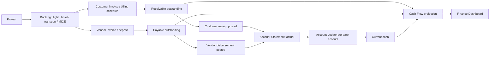
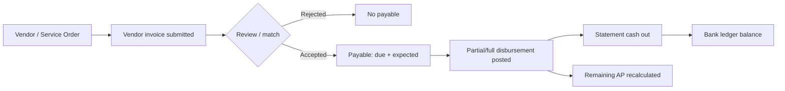
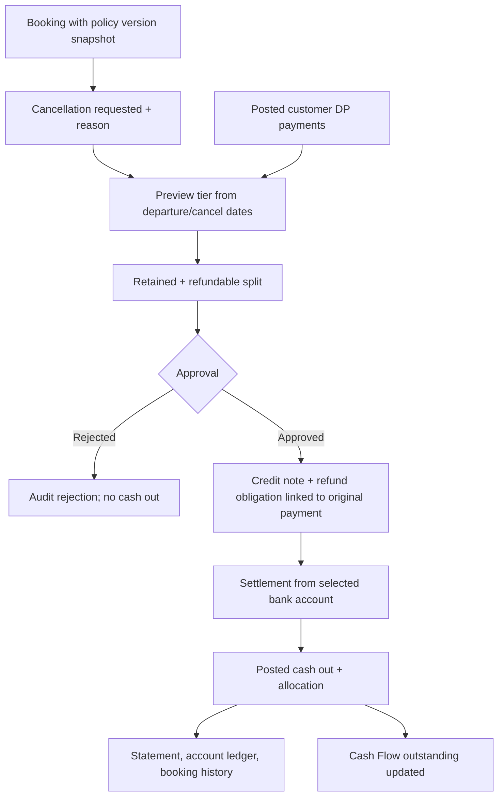
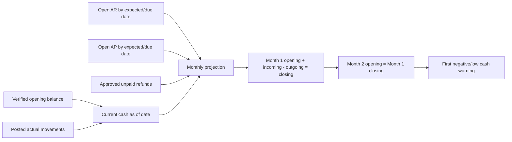
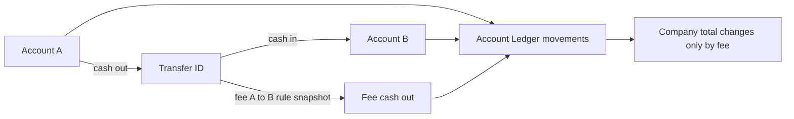

# Diagram flow utama

Diagram adalah target arsitektur, bukan representasi bahwa backend sekarang sudah menjalankannya.

## Project → Booking → AR/AP → actual → proyeksi



## Customer invoice → receivable → receipt

```mermaid
sequenceDiagram
  participant O as Project/Booking
  participant F as Finance API
  participant A as Account
  O->>F: Issue customer invoice (project, party, due/expected)
  F->>F: Create AR once; no cash movement
  F-->>O: Invoice + outstanding
  O->>F: Record receipt + AR allocations + idempotency key
  F->>F: Validate scope, amount, allocation, status
  F->>A: Post cash in atomically
  F->>F: Reduce AR and append audit
  F-->>O: Movement, new outstanding, statement link
```

## Vendor invoice → payable → payment



## Cancellation policy → credit → refund settlement



## Cashflow projection: actual vs expected



## Transfer per rekening


