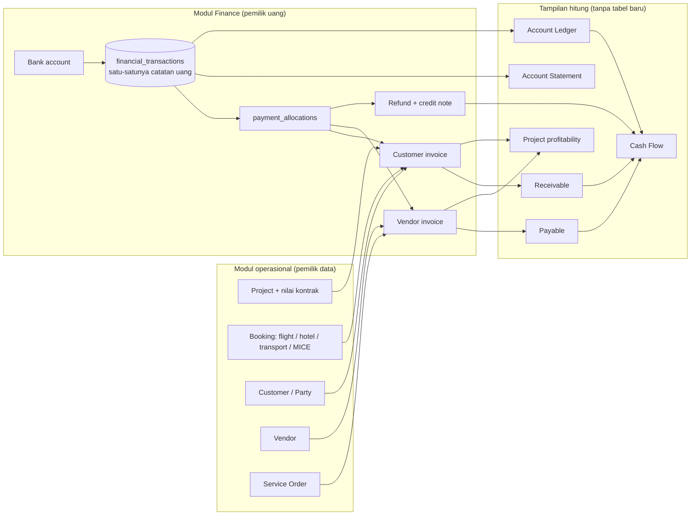
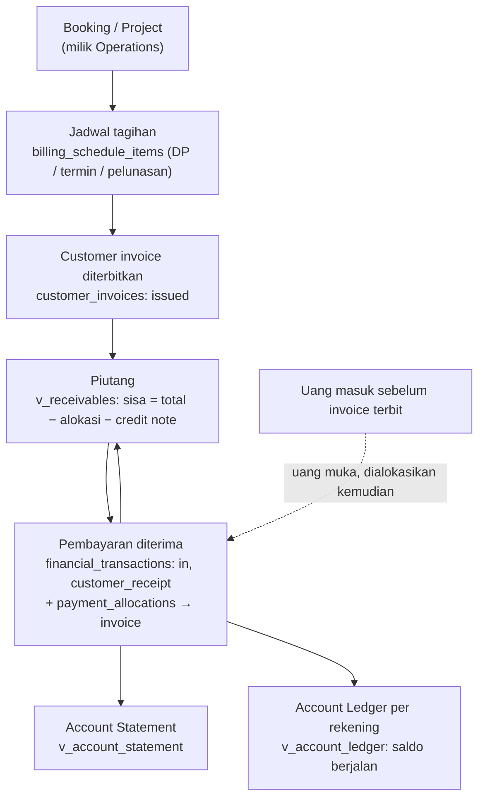
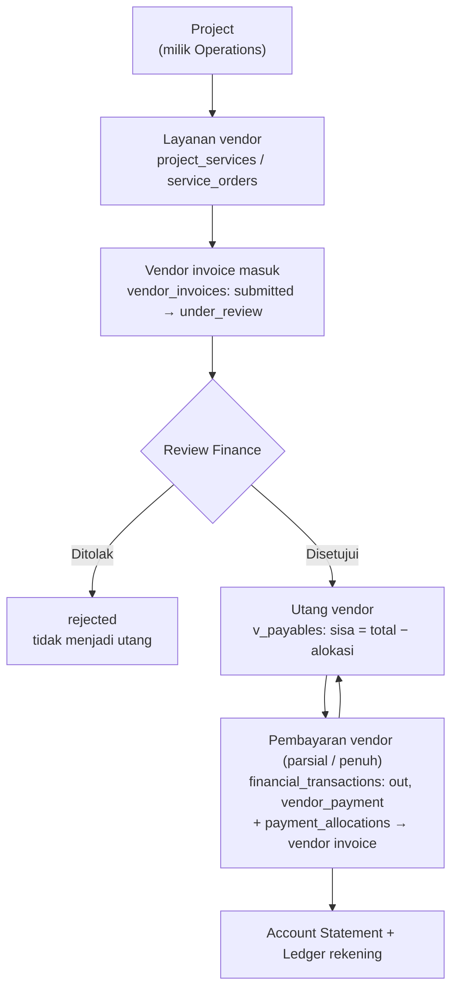
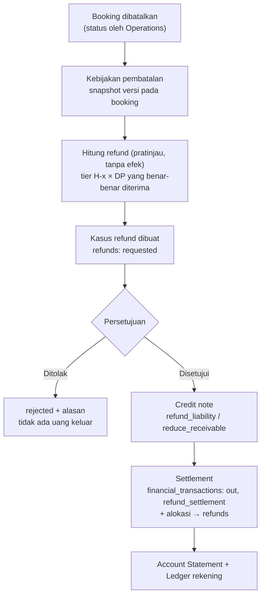
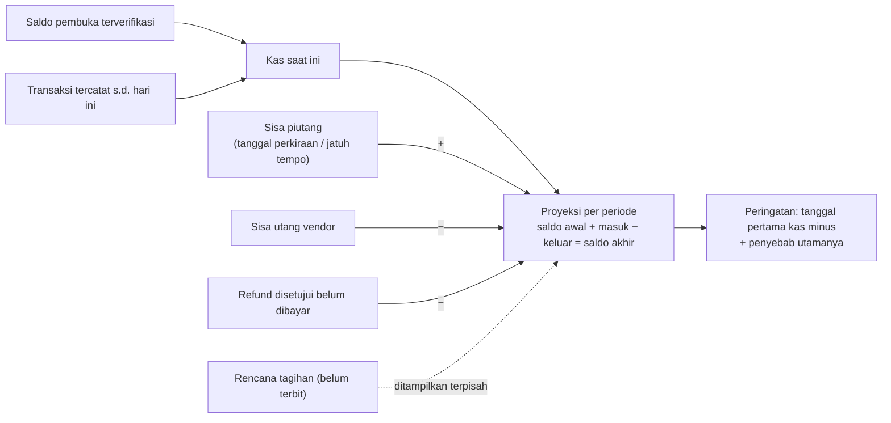

# Finance MANOVA — Domain Mapping, Gap, dan Rancangan V1

**Tanggal:** 29 Sep 2026. **Kondisi repo:** `monorepo` @ `c5ab7ea`, setelah ADR-006 (tiga role + login satu-klik).

**Status: PROPOSAL, belum diimplementasikan.** Dokumen ini tidak mengubah kode. Butuh approval sebelum coding (lihat §13).

**Cara membaca:**
- Setiap klaim tentang kondisi saat ini disertai path/baris sumber.
- "Mock" berarti data berupa array `reactive()` di `frontend/app/data/*`. Mock tidak persisten, dan setiap browser punya salinannya sendiri.
- "Server" berarti backend Bun + Elysia + PostgreSQL di `backend/`.

Dokumen ini menjawab tujuh output yang diminta:

1. Arsitektur → §1
2. Domain mapping → §2–§3
3. Dampak database → §5–§6
4. Kebutuhan API → §9
5. Kebutuhan halaman → §10
6. Rencana fase → §11
7. Risiko → §12

Alur pengguna (Mermaid) ada di §8.

---

## 0. Ringkasan untuk pengambil keputusan

1. **Uang sekarang hanya ada di mock frontend, dan angkanya saling bertentangan.** Server belum punya satu pun tabel invoice, payment, atau rekening.
   - Mock memiliki invoice, payment, credit/debit note, supplier invoice, opex, dan "general ledger" turunan.
   - Tetapi ada **tiga rumus sisa tagihan yang berbeda** (§4.1).
   - `actualCostIdr` bawaan project meleset hingga ratusan kali lipat dari hasil hitung (§4.2).
   - Aturan pembatalan tidak pernah dipakai, dan refund dari UI tidak pernah menerbitkan credit note (§4.3).
   - **Kesimpulan: mock adalah peta perilaku, bukan sumber data untuk dimigrasikan sebagai uang sungguhan.**
2. **Belum ada sama sekali:**
   - Rekening bank dan saldo pembuka.
   - Transaksi kas yang benar-benar tercatat.
   - Pembayaran vendor parsial.
   - Deposit dan jadwal pembayaran (DP/termin sebagai rencana).
   - Kebijakan pembatalan yang dihitung.
   - Proyeksi kas.
3. **Rekomendasi inti: satu buku kas sederhana, bukan akuntansi debit-kredit.**
   - Semua uang masuk/keluar dicatat sekali di `financial_transactions` (per rekening), lalu dialokasikan ke tagihan customer, tagihan vendor, atau refund.
   - **Account Statement, Account Ledger, Receivable, Payable, dan Cash Flow adalah *tampilan hitung* dari data itu, bukan tabel baru.** Dengan begitu tidak ada angka ganda yang bisa tidak cocok.
4. **Finance menempel ke domain yang ada, tidak menyalinnya.**
   - Project, booking, customer, vendor, dan service order dirujuk lewat ID yang sudah dipakai frontend (`PRJ-101`, `FLT-1011`, `PTY-005`, `VND-006`, `SO-002`), melalui tabel referensi server yang dibangun di Phase 1.
   - Nilai kontrak project dan harga jual booking tetap **milik** modul Project/Booking.
5. **Ada tiga keputusan yang perlu disetujui** sebelum coding (§13). Yang terpenting adalah keputusan #1: siapa pemilik nilai kontrak project dan harga booking di server. Saat ini angka-angka itu hanya ada di mock.

---

## 1. Rekomendasi arsitektur Finance



**Prinsip:**
- **Travel Operation Financial Management, bukan ERP.** Yang dilacak adalah uang masuk, uang keluar, kewajiban customer, kewajiban vendor, posisi kas, dan profitabilitas project.
- Tidak ada debit/kredit, chart of account, maupun akuntansi pajak. "Ledger" berarti **buku rekening bank** (saldo awal → mutasi → saldo akhir), bukan General Ledger.
- **Uang = transaksi yang terjadi.** Invoice menyatakan kewajiban, `financial_transactions` menyatakan uang yang benar-benar bergerak. Persetujuan bukan pembayaran. Credit note bukan refund yang sudah dibayar.
- **Satu sumber per fakta.** Sisa tagihan, saldo, dan proyeksi dihitung di server dari data yang sama. Vue hanya menampilkan.
- **Transaksi tercatat tidak bisa diedit atau dihapus.** Koreksi dilakukan dengan transaksi balik (reversal) beralasan. Setiap posting memakai idempotency key dan satu transaksi DB. Semua perubahan diaudit (`audit_events`, sudah ada).
- **Finance tidak memblokir operasional.** Peringatan bersifat saran. Gate penutupan project yang sudah ada dievaluasi ulang memakai sumber baru.
- **Role (ADR-006):**
  - Finance = pembuat (maker).
  - Super Admin = pemeriksa (checker: saldo pembuka, pengecualian).
  - Admin tidak melihat Finance. Apakah Admin boleh melihat **status bayar tanpa nominal** di booking/project adalah keputusan terbuka (§13 #3).

---

## 2. Audit domain yang ada

### 2.1 Frontend (Nuxt 4) — ringkasan arsitektur

| Aspek | Kondisi aktual | Sumber |
|---|---|---|
| Route | ±150 halaman berbasis file per modul: dashboard, operations/project-orders, bookings (4 tipe), changes, sales/crm/customer-journey, vendors/procurement, finance (5 halaman + 5 redirect), reports, admin, HR/inventory/marketing/documents, portal client (disembunyikan), portal supplier (disembunyikan), settings, login. | `frontend/app/pages/**` |
| Layout | Satu layout `dashboard` (AppSidebar + TopHeader + main + ToastContainer). Halaman preview dan login tanpa layout. | `layouts/dashboard.vue:1-12` |
| Navigasi | `NAV_ITEMS` per grup ber-`moduleKey`. Finance = grup "Finance & ACC" dengan `moduleKey: 'finance-acc'` dan 5 anak. | `constants/navigation.ts:79-211` |
| Permission | `usePermissions()` menyediakan `canView/canManage/canApprove`, `can(capability)`, `isRole`, dan `canViewFinancials`. Guard halaman `RoleAccessState` dipakai di 68 halaman. Middleware route kini juga berjalan di SSR (ADR-006). | `composables/usePermissions.ts`, `middleware/rbac.global.ts` |
| Design system | shadcn-nuxt (reka-ui): Dialog, Sheet, Tabs, Table + TableEmpty, Select, Popover, Tooltip, **CurrencyInput**. Komponen bersama: PageHeader, SectionCard, StatusBadge, EmptyState, LoadingState, ErrorState, DetailMetadataList. Dashboard: StatsCard, DashboardPanel, DashboardHeroPanel. Chart.js dipakai di 2 komponen. | `components/{ui,shared,dashboard}/*` |
| Data | Semua halaman membaca array `reactive()` dari `~/data/*` secara sinkron. **Tidak ada satu pun layar yang memanggil API** kecuali login dan logout. API client bertipe sudah ada (`lib/api/*`, `useApi`). Pola loading/error/retry belum ada. | `app/data/*`, `lib/api/*` |
| Dashboard | Satu halaman dengan widget per role (`visibleTo`) dan grid `DashboardPanel` bertingkat (`tierOf`). Widget uang (hero pendapatan, cash-flow chart, outstanding) kini hanya untuk Finance dan Super Admin. | `pages/index.vue` |

### 2.2 Halaman detail — apa yang tampil sekarang dan di mana konteks Finance ditempel

| Halaman | Tab / bagian | Uang yang tampil hari ini | Titik tempel konteks Finance (baca-saja) |
|---|---|---|---|
| **Project** `project-orders/[id]` (3221 baris) | Overview, Itinerary & Services, Travelers, Vendors, **Finance** (hanya role ber-akses Finance), Tasks, Documents, Activity & Changes | Kartu ringkasan: Budget / Actual / Nilai Quotation (**tanpa gate**, lihat risiko R3). Tab Finance: invoice, riwayat bayar, credit/debit note, ringkasan AP, jurnal, tutup finance. | Isi tab Finance diganti panel yang membaca `GET /projects/{id}/finance-summary`. |
| **Booking** `ticketing/[id]`, `accommodation/[id]`, `transportation/[id]`, `mice/[id]` (tanpa tab) | Ringkasan, opsi, segmen/rooming/leg, dan kartu **Financial** (Net/Sell/Margin, gated `canManage(domain) \|\| canViewFinancials`) | Harga net/jual per booking, penalti hotel. MICE memakai BOQ. | Kartu baru setelah kartu Financial (ticketing :366, accommodation :380, transportation :398, mice :537) yang membaca `GET /bookings/{type}/{id}/finance-summary`. |
| **Daftar booking** `bookings` | Timeline + exceptions. Kolom "Payment Gate" adalah flag manual. | `paymentGateStatus` tidak terhubung ke payment mana pun. | Diganti status bayar hasil hitung. |
| **Vendor** `vendors/[id]` | Overview, Services, Quotations, Products, Documents, Contacts | Nilai quotation vendor, harga produk. **Tidak ada AP maupun pembayaran.** | Tab baru "Tagihan & Pembayaran" yang membaca `GET /vendors/{id}/finance-summary`. |
| **Customer** `crm/parties/[id]` dan `customer-journey/customers/[id]` (dua halaman detail, R7) | Overview, Contacts, Leads, Activities, Projects, dll. | Nilai quotation lead, dan "invoiced" per project (jumlah mentah invoice). | Kartu di Overview: total tagihan, sisa, dan jatuh tempo terdekat (`GET /parties/{id}/finance-summary`). |
| **Portal client** `client/billing/**`, `client/project-orders/[id]` tab Billing | Ringkasan tagihan, daftar invoice, bukti bayar (mock tanpa file), sengketa, statement cetak | `getClientFinanceSummary`, yang rumusnya salah (§4.1). | **Portal sedang disembunyikan (ADR-006).** Fase aktivasi portal memakai endpoint client yang disanitasi. |
| **Portal supplier** `supplier/service-orders/[id]` | Form kirim invoice supplier, daftar invoice terkirim | Nilai invoice supplier | Sama: disembunyikan. Nanti memakai endpoint vendor yang disanitasi. |

### 2.3 Backend (server) — kondisi aktual

| Aspek | Kondisi aktual | Sumber |
|---|---|---|
| Schema | 11 tabel, skema v4:<br/>• `audit_events` (append-only, trigger)<br/>• referensi inti: `parties`, `vendors`, `projects`, `project_members`, `project_services`, `service_orders`, `booking_refs`<br/>• identitas: `users`, `sessions`<br/>• `schema_migrations`<br/>**Tidak ada kolom uang dan tidak ada tabel invoice/payment.** | `backend/migrations/0001–0004` |
| Relasi | party ← project ← project_service → vendor. Booking ref `(type, id)` → project (+ service di project yang sama, FK komposit). Service order → vendor (+ project/service). User → party/vendor untuk portal. | `0002_core_references.up.sql` |
| Service layer | Belum ada lapisan service terpisah. Modul = `routes.ts` (HTTP) + `repository.ts` (SQL berscope) + `scope.ts` (aturan baris). | `backend/src/modules/core/*` |
| Pola API | `/api/v1`, envelope `{data, meta.requestId}`, error berkode, paginasi cursor, uang `amountMinor` string. | ADR-001, `src/http/*` |
| Validasi | Skema Elysia `t` + validasi manual berpesan Indonesia. Uang via `parseAmountMinor` (BigInt), tanggal via `isIsoDate`. | `src/shared/{money,dates}.ts` |
| Otorisasi | `requireActor` / `requireCapability` + scope baris (`projectScopeSql`). Data di luar scope → 404. Capability `finance.*` sudah didefinisikan (Finance + Super Admin). | `src/auth/*`, `src/modules/core/scope.ts` |
| Audit | `recordAudit(tx, …)` dalam transaksi yang sama. Tabel ditolak untuk UPDATE/DELETE. | `src/shared/audit.ts` |
| Entitas yang dicari | Project ✔ (tanpa nilai uang) · Booking ✔ (hanya referensi) · Customer ✔ (tanpa field billing) · Vendor ✔ · Service order ✔ (tanpa harga) · **Invoice/payment ✘** · User/role/permission ✔ (role di tabel, matriks di kode) | — |

---

## 3. Mapping existing → kebutuhan Finance

Legenda: **Server** = ada di backend · **Mock** = hanya di frontend mock (bukan sumber kebenaran) · **Gap** = belum ada di mana pun.

### 3.1 Project

| Kebutuhan Finance | Sumber saat ini | Status | Rencana |
|---|---|---|---|
| `project_id` | `projects.id` (server), sama dengan mock `PRJ-xxx` | Server | Dipakai langsung sebagai FK. |
| Customer | `projects.party_id` → `parties` | Server | FK. |
| Booking | `booking_refs (type, id) → project_id` | Server | Invoice atau refund boleh merujuk satu booking (opsional). |
| Vendor | `project_services.vendor_id`, `service_orders.vendor_id` | Server | Vendor invoice merujuk vendor + service order. |
| **Nilai project** (untuk "sisa belum ditagih" dan profitabilitas) | Mock `Project.quotationAmountIdr`, hanya diisi saat lead Won dan tidak pernah diperbarui oleh revisi quotation atau change request. Hanya PRJ-104 yang punya `sourceQuotationId`. | **Mock / Gap** | **Keputusan #1.** Usulan: kolom `contract_value_minor` + `contract_currency` di `projects`, dimiliki modul Project (bukan Finance). |
| Referensi biaya operasional | Mock `Project.budgetIdr` (statis), `getProjectActualCostIdr` (supplier invoice + opex), `getCommittedVendorCostIdr` (quotation vendor accepted), `ServiceOrder.netCostIdr` | Mock, tidak konsisten | V1: biaya aktual = vendor invoice approved + expense ber-project. Biaya komitmen = service order `net_cost` (milik procurement). Budget tetap milik modul Project. |

### 3.2 Booking

| Kebutuhan Finance | Sumber saat ini | Status | Rencana |
|---|---|---|---|
| Nilai booking | Mock `sellPriceIdr` / `netCostIdr` di 4 tipe booking. MICE memakai BOQ (`getMiceBoqTotals`). Tidak mengalir ke invoice mana pun. | Mock | Tetap milik modul Booking. Finance hanya merujuk (keputusan #1: ikut disinkronkan ke `booking_refs` atau dibaca dari API booking). |
| Deposit | Hanya `InvoiceType 'dp'`, plus teks bebas ("DP 30% …" di quotation, "Deposit 50%" di kebijakan hotel). Tidak ada entitas deposit. | **Gap** | Deposit = invoice ber-`invoice_type = 'dp'`. Uang yang diterima sebelum invoice terbit disimpan sebagai **uang muka customer** (transaksi masuk tanpa alokasi, dialokasikan kemudian). |
| Jadwal pembayaran | `PaymentTerm` master (daysDue) hanya dipakai layar admin. `Quotation.paymentTerms` dan `Party.paymentTerm` berupa teks bebas. | **Gap** | `billing_schedule_items` (rencana termin per project/booking) → dasar penerbitan invoice dan baris "rencana tagihan" di Cash Flow. |
| Customer | via project → party | Server | — |
| Kebijakan pembatalan | `CancellationRule` master (4 aturan). **Tidak pernah dipakai menghitung.** Penalti diketik manual. | Mock (tidak berfungsi) / Gap | `cancellation_policies` + `cancellation_rules` (tier) + snapshot per booking (Phase 5). |
| Referensi invoice | Mock invoice hanya punya `projectId`, tidak merujuk booking. | Gap | `customer_invoices.booking_type/booking_id` opsional. |
| Tanggal berangkat (untuk H-x) | Mock `segments[].departureAt`, `checkInDate`, `legs[].scheduledAt`, `sessions[].startAt`. Server belum punya. | Mock / Gap | Keputusan #1 (ikut dimiliki modul Booking). Wajib sebelum Phase 5. |

### 3.3 Customer (Party)

| Kebutuhan Finance | Sumber saat ini | Status | Rencana |
|---|---|---|---|
| Identitas | `parties` (id, name, type, preferred_currency) | Server | FK. |
| Informasi billing | Mock `billingName`, `billingAddress`, `npwp`, `paymentTerm` (teks), `poRequired`. Hanya dibaca halaman profil portal. | Mock | Milik modul CRM. Usul: tambah kolom billing di `parties` (CRM yang menulis). Invoice **menyimpan salinan snapshot** alamat billing saat diterbitkan, karena dokumen legal tidak boleh ikut berubah. |
| Outstanding | Mock `getClientFinanceSummary` (rumus salah, §4.1) | Mock / Gap | Tampilan hitung `v_receivables` diagregasi per party. |

### 3.4 Vendor

| Kebutuhan Finance | Sumber saat ini | Status | Rencana |
|---|---|---|---|
| Identitas | `vendors` | Server | FK. Rekening bank vendor (untuk transfer) = gap kecil, V1 cukup teks referensi pada pembayaran. |
| Invoice | Mock `SupplierInvoice` (submitted → under-review → approved/rejected → paid, `matchStatus`, `paymentScheduleDate`). Fixture menagih **harga jual** (SINV-001 = sell price SO-001), bukan net cost. | Mock | `vendor_invoices` (server), status dokumen terpisah dari status bayar. |
| Payable | Mock `getPayables` (outstanding = nominal penuh; tidak ada bayar parsial) | Mock / Gap | Tampilan hitung `v_payables`. |
| Riwayat pembayaran | Mock hanya `status 'paid'` + `paidAt`. Tidak ada nominal, rekening asal, atau parsial. | **Gap** | Transaksi keluar + alokasi ke vendor invoice. |

---

## 4. Temuan audit yang menentukan desain

### 4.1 Tiga rumus "sisa tagihan" yang bertentangan (mock)

| Fungsi | Rumus | Masalah |
|---|---|---|
| `getInvoiceOutstandingIdr` (`data/index.ts:223`) | nominal − pembayaran − credit note | Rujukan yang paling benar. |
| `getReceivables` (`data/finance-ext.ts:143`) | nominal − pembayaran | Mengabaikan credit note. |
| `getClientFinanceSummary` (`data/index.ts:6456`) | "dibayar" = total invoice (termasuk void) − outstanding | Invoice void dan credit note terhitung sebagai "sudah dibayar". |

Masalah terkait lainnya:
- `issueCreditNote` tidak memperbarui status invoice.
- `getRevenueByPeriod` memasukkan supplier invoice yang **rejected** sebagai biaya.

**Implikasi:** server memakai **satu** rumus dan satu tampilan hitung. Tidak ada layar yang menghitung sendiri.

### 4.2 Biaya aktual project tidak bisa dipercaya

`Project.actualCostIdr` (bawaan) dipakai oleh `isBudgetOverrun` dan dashboard, padahal nilainya jauh dari hasil hitung `getProjectActualCostIdr`:

| Project | Bawaan | Hasil hitung |
|---|---|---|
| PRJ-102 | 335 jt | 46,8 jt |
| PRJ-103 | 1,18 M | 4,65 jt |
| PRJ-101 | 82,5 jt | 0 |

Profitabilitas V1 hanya dihitung dari vendor invoice + expense yang tercatat di server.

### 4.3 Pembatalan dan refund tidak terhubung ke uang

- `CANCELLATION_RULES` tidak dipakai menghitung apa pun.
- Penalti diketik manual.
- Refund `processed` hanya menerbitkan credit note **jika** `invoiceId` diisi, dan UI tidak pernah mengisinya.
- Tidak ada pencatatan uang keluar untuk refund.
- Estimasi biaya change request (`cancellationFeeIdr`) tidak mengalir ke tagihan mana pun.

### 4.4 Flag yang tampak seperti status bayar tapi bukan

- `paymentGateStatus` booking: flag manual ("Mark Payment Cleared") yang sengaja tidak terhubung ke invoice atau payment.
- `SalesOrder.status 'paid'`: status saja, tanpa invoice.
- `runPaymentVerificationMock`: memverifikasi bukti bayar client secara otomatis tanpa review Finance.

**Implikasi:** semua flag ini diganti status hasil hitung dari transaksi.

### 4.5 Yang boleh dipertahankan sebagai konsep

Konsep berikut dari mock dipakai ulang, **tanpa datanya**:
- `InvoiceType dp/progress/final`.
- Status sengketa (`disputed`).
- Bukti bayar client (klaim pembayaran).
- Tanggal jadwal bayar vendor.
- Match status vendor invoice.
- Kategori opex.
- Label status berbahasa Indonesia.

---

## 5. Gap Finance

"Ada di mock" **tidak** dihitung sebagai "sudah ada", karena mock tidak persisten dan bukan sumber kebenaran.

| Kebutuhan Finance | Sudah ada? | Tindakan |
|---|---|---|
| Customer Invoice | **Mock saja.** Tipe `Invoice` + mutator, rumus tidak konsisten. Server: tidak ada. | Bangun `customer_invoices` + `customer_invoice_lines` di server. Mock menjadi referensi perilaku, lalu dihapus setelah konsumen pindah. |
| Vendor Invoice | **Mock saja** (`SupplierInvoice`). Server: tidak ada. | Bangun `vendor_invoices` (status dokumen) yang merujuk vendor + service order. |
| Payment Record | **Mock parsial.** Payment customer tanpa rekening dan tanpa status. Pembayaran vendor hanya status `paid`. Server: tidak ada. | Bangun `financial_transactions` + `payment_allocations` (satu model untuk uang masuk dan keluar). |
| Bank Account | **Tidak ada** (hanya akun GL "1100 Kas & Bank"). | Bangun `bank_accounts` + saldo pembuka terverifikasi. |
| Receivable | **Mock** (`getReceivables`, rumus salah). | Tampilan hitung `v_receivables` dari invoice − alokasi − credit note. |
| Payable | **Mock** (`getPayables`, tanpa parsial). | Tampilan hitung `v_payables` dari vendor invoice approved − alokasi. |
| Account Statement | **Tidak ada** (statement portal client = daftar invoice, bukan mutasi rekening). | Tampilan hitung `v_account_statement` dari `financial_transactions`. |
| Ledger (per rekening) | **Tidak ada.** Yang ada General Ledger turunan (debit/kredit), yang menurut prinsip §1 tidak dipakai. | Tampilan hitung `v_account_ledger`: saldo awal, mutasi, dan saldo berjalan per rekening. GL mock dihapus di Phase 4. |
| Cash Flow Projection | **Tidak ada.** Chart dashboard = pendapatan vs biaya historis mock. | Hitung di server: kas saat ini + receivable diharapkan − payable diharapkan − refund disetujui. Tanpa tabel baru. |
| Refund / Credit Note | **Mock parsial.** `RefundRequest`, `CreditNote`, `CancellationRecord`, tanpa perhitungan dan tanpa uang keluar. | `cancellation_policies`, `cancellation_rules`, snapshot per booking, `refunds`, `credit_notes`. Settlement = transaksi keluar + alokasi ke refund. |
| Jadwal pembayaran / deposit | **Tidak ada** (hanya teks bebas dan `InvoiceType 'dp'`). | `billing_schedule_items` + uang muka customer (transaksi tanpa alokasi). |
| Nilai kontrak project / harga booking di server | **Tidak ada** (hanya mock). | Keputusan #1 (§13). |
| Transfer antar rekening + biaya | **Tidak ada.** | `transfers` (satu transfer = dua transaksi + biaya). |
| Pengeluaran non-project (opex) | **Mock** (`OPEX_ENTRIES`). | Transaksi keluar ber-`kind = 'expense'` + kategori, project opsional. |
| Bukti transfer (file) | **Tidak ada** (upload mock tanpa file). | `attachments` (ADR-005, masih usulan). |

---

## 6. Rancangan data model V1 (proposal)

**Konvensi (sudah berlaku di repo):**
- ID teks.
- Uang `bigint` minor unit (`*_minor`); IDR tanpa sen.
- Tanggal bisnis `date` Asia/Jakarta; waktu `timestamptz`.
- Kolom `provenance`.
- Audit lewat `audit_events`.
- Semua posting dalam satu transaksi DB dengan idempotency key.

Nama tabel mengikuti daftar yang diminta. Tabel yang **direkomendasikan sebagai tampilan hitung, bukan tabel**, ditandai 🔍, beserta alasannya.

### 6.1 Finance Core

| Tabel | Kolom utama | Aturan / constraint |
|---|---|---|
| `bank_accounts` | id, code (unik), bank_name, holder_name, account_number (akses terbatas; API mengembalikan versi tersamar kecuali pemegang `finance.manage-bank-accounts`), currency (V1: IDR), is_active, opening_balance_minor, opening_date, opening_status (`draft`/`verified`), opening_verified_by/at | Rekening yang sudah dipakai tidak bisa dihapus, hanya dinonaktifkan. Saldo pembuka diverifikasi oleh Super Admin (maker/checker). Selama belum terverifikasi, saldo tampil "Belum tersedia", bukan Rp0. |
| `financial_transactions` *(satu-satunya catatan uang)* | id, bank_account_id, direction (`in`/`out`), amount_minor > 0, currency, kind (`customer_receipt`, `vendor_payment`, `refund_settlement`, `expense`, `other_income`, `transfer_in`, `transfer_out`, `transfer_fee`), effective_date, posted_at, project_id?, booking_type/booking_id?, party_id?, vendor_id?, counterparty, reference, memo, category? (untuk expense), transfer_id?, attachment_id?, reversal_of_id? (unik), idempotency_key (unik), created_by | **Tidak pernah di-UPDATE atau DELETE** (trigger seperti audit). Koreksi = baris balik yang merujuk `reversal_of_id`. Rekening harus aktif dan mata uang harus sama. |
| `payment_allocations` | id, transaction_id, target_type (`customer_invoice`/`vendor_invoice`/`refund`), target_id, amount_minor > 0 | Σ alokasi ≤ nominal transaksi. Alokasi ≤ sisa target (dikunci `FOR UPDATE`). Sisa yang belum dialokasikan pada uang masuk = uang muka customer. |
| `transfers` | id, from_account_id, to_account_id, amount_minor, fee_minor, effective_date, created_by | Menghasilkan `transfer_out` + `transfer_in` (+ `transfer_fee`) dalam satu transaksi DB. Kas perusahaan hanya berkurang sebesar biaya. |
| 🔍 `account_statements` | → **view** `v_account_statement` atas `financial_transactions` | Menyimpan statement terpisah berarti angka ganda. Statement = daftar mutasi terfilter (tanggal/rekening/project/arah). |
| 🔍 `ledger_entries` | → **view** `v_account_ledger`: saldo awal periode, mutasi dengan saldo berjalan (window function), saldo akhir, per rekening | Tidak ada jurnal debit/kredit (prinsip §1). Ledger = buku rekening. |
| `attachments` | id, sha256, mime, size, storage_key, owner_type/owner_id, uploaded_by | ADR-005 (diputuskan di awal pembangunan). |
| `idempotency_keys` | key, actor, route, request_hash, response, created_at | Retry tidak menggandakan posting. |

### 6.2 Receivable

| Tabel | Kolom utama | Aturan |
|---|---|---|
| `customer_invoices` *(nama yang diminta: `invoices`; diberi prefiks agar tidak tertukar dengan vendor)* | id, number (unik), project_id, party_id, booking_type/booking_id?, billing_schedule_item_id?, invoice_type (`dp`/`progress`/`final`/`other`), status (`draft`/`issued`/`void`), is_disputed, issue_date, due_date, expected_date?, currency, total_minor, billing_snapshot (nama/alamat/NPWP saat terbit), void_reason, created_by | Draft tidak dihitung sebagai piutang. Terbit wajib punya due date dan baris invoice. Invoice yang sudah ada pembayarannya tidak bisa di-void tanpa alur credit/refund. |
| `customer_invoice_lines` | id, invoice_id, description, amount_minor | Σ baris = total. |
| `billing_schedule_items` *(tambahan, untuk "jadwal pembayaran")* | id, project_id, booking_type/booking_id?, label, invoice_type, amount_minor, planned_date, status (`planned`/`invoiced`/`cancelled`) | Rencana termin. Tampil di Cash Flow sebagai "rencana tagihan", terpisah dari piutang. |
| 🔍 `receivables` | → **view** `v_receivables`: per invoice `issued`, sisa = total − Σ alokasi posted − Σ credit note pengurang piutang; status hitung (`open`/`partial`/`paid`/`overdue`) | Satu rumus. Menggantikan tiga rumus mock. |
| 🔍 `payment_records` | → `financial_transactions` (`kind = 'customer_receipt'`) + alokasi | Tabel "payment" terpisah akan menyalin data transaksi. |
| `payment_claims` *(opsional, saat portal client aktif)* | id, invoice_id, submitted_by, amount_minor, reference, attachment_id, status (`submitted`/`verified`/`rejected`) | Bukti bayar dari client adalah **klaim**. Uang baru tercatat saat Finance memverifikasi menjadi transaksi. |

### 6.3 Payable

| Tabel | Kolom utama | Aturan |
|---|---|---|
| `vendor_invoices` | id, vendor_id, vendor_invoice_number (unik per vendor), service_order_id?, project_id?, booking_type/booking_id?, status (`submitted`/`under_review`/`approved`/`rejected`/`void`), match_status, invoice_date, due_date, expected_date? (jadwal bayar), total_minor, attachment_id?, reviewed_by/at | Hanya status `approved` yang menjadi utang. Approved **bukan** berarti sudah dibayar. |
| 🔍 `payables` | → **view** `v_payables`: sisa = total − Σ alokasi posted | Pembayaran vendor parsial didukung. |
| 🔍 `vendor_payments` | → `financial_transactions` (`kind = 'vendor_payment'`) + alokasi | Sama seperti payment customer. |
| `vendor_advances` *(bila dibutuhkan)* | → uang keluar tanpa alokasi, lalu dialokasikan ke vendor invoice berikutnya | Tanpa tabel baru. |

### 6.4 Refund

| Tabel | Kolom utama | Aturan |
|---|---|---|
| `cancellation_policies` | id, code, name, booking_type scope, basis (`paid_customer_deposit`), status (`draft`/`published`/`inactive`), version, effective_from/to | Versi yang sudah terbit tidak bisa diedit. Perubahan = versi baru. |
| `cancellation_rules` *(tier)* | id, policy_id, min_days_before, max_days_before?, refund_bp, forfeit_bp (basis point; jumlahnya 10.000) | Tier tidak boleh tumpang tindih atau berlubang. |
| `booking_policy_snapshots` | booking_type, booking_id (PK), policy_id, version, snapshot jsonb, assigned_by/at | Perubahan master tidak mengubah kasus lama. |
| `refunds` *(kasus pembatalan + kewajiban refund)* | id, project_id, booking_type/booking_id, original_transaction_id, cancellation_ref (ID record pembatalan operasional), basis_minor, refundable_minor, retained_minor, policy_snapshot, status (`requested`/`approved`/`rejected`), approved_by/at, reject_reason | Refund ≤ uang yang benar-benar diterima − refund sebelumnya. Status lunas dihitung dari alokasi. |
| `credit_notes` | id, number, customer_invoice_id, refund_id?, effect (`reduce_receivable`/`refund_liability`), amount_minor, reason, status (`issued`/`void`) | Satu credit note tidak boleh sekaligus mengurangi piutang dan mengakui refund kas (tidak ada efek ganda). |
| 🔍 `settlements` | → `financial_transactions` (`kind = 'refund_settlement'`) + alokasi ke `refunds` | Settlement = uang keluar nyata, bisa parsial. |

### 6.5 Cash Flow (tanpa tabel)

```text
Kas saat ini (per tanggal) = Σ saldo pembuka terverifikasi + Σ transaksi masuk − Σ transaksi keluar (s.d. tanggal itu)
Proyeksi per periode       = saldo awal
                           + Σ sisa piutang (tanggal expected, jika tidak ada: due)
                           − Σ sisa utang vendor (expected/due)
                           − Σ refund disetujui yang belum dibayar
Saldo akhir periode        = saldo awal periode berikutnya
```

- Piutang dan utang yang lewat jatuh tempo masuk periode pertama dengan label "terlambat".
- Rencana tagihan (`billing_schedule_items`) ditampilkan sebagai baris terpisah dan tidak masuk total secara default.
- Horizon 30 hari / 3 / 6 / 12 bulan. Tanpa prediksi histori atau ML (paket `07`).

### 6.6 Dampak database

| Aspek | Dampak |
|---|---|
| Migrasi baru | ±5 migrasi berurutan (core uang → AR → AP → refund → view). Semuanya **additive**; tidak ada tabel yang diubah atau dihapus, kecuali keputusan #1 yang menambah kolom nilai di `projects`/`booking_refs`. |
| Tabel referensi (Phase 1) | Menjadi target FK. Keputusan #1 menambah kolom nilai kontrak/harga + tanggal berangkat (dimiliki modul Project/Booking). |
| Integritas | FK, check (`amount_minor > 0`, tier), unique (nomor invoice, idempotency, vendor invoice per vendor), trigger immutabilitas transaksi. Sisa ≥ 0 dijaga di service dengan `SELECT … FOR UPDATE`. |
| Index | `(bank_account_id, effective_date, id)`, `(project_id, due_date)`, `(status, expected_date)`, `(target_type, target_id)`, `(booking_type, booking_id)`, `(vendor_id, vendor_invoice_number)`. |
| Data demo | Seed **terpisah** berisi skenario keuangan test-only yang eksplisit (paket `10`): 2 rekening, 2 project, DP parsial, pelunasan, 2 vendor invoice, 1 policy 4 tier, 1 refund, 1 transfer. Mock lama **tidak** dimigrasikan sebagai uang sungguhan, karena angkanya tidak konsisten (§4). |
| Produksi | Cutover = input dan verifikasi saldo pembuka per rekening pada tanggal cutover. Transaksi sebelum cutover hanya sebagai riwayat. Rehearsal backup/restore memakai alat Phase 1. |

---

## 7. Kepemilikan data

Setiap fakta punya satu pemilik yang menulisnya. Modul lain hanya merujuk lewat ID atau membaca lewat API.

| Data | Pemilik | Finance… |
|---|---|---|
| Project (nama, customer, tanggal, status, tim) | **Project** | merujuk `project_id`. |
| Nilai kontrak project, budget | **Project** (dari quotation Sales) | membaca untuk "sisa belum ditagih" dan profitabilitas. Tidak menyimpan salinan. |
| Booking (4 tipe), status, tanggal berangkat, harga net/jual | **Booking / Operations** | merujuk `(booking_type, booking_id)`; membaca harga dan tanggal berangkat. |
| Pembatalan booking (status operasional) | **Booking / Operations** | menerima referensi pembatalan untuk menghitung refund. Tidak mengubah status booking. |
| Customer (identitas, alamat billing, NPWP, termin) | **CRM** | membaca. Invoice menyimpan *snapshot* alamat billing saat terbit (dokumen legal, bukan duplikasi master). |
| Vendor, service order, harga net service order | **Vendor / Procurement** | merujuk. |
| Customer invoice, jadwal tagihan, credit note | **Finance** | memiliki. |
| Vendor invoice (review, approval) | **Finance**; vendor mengirim, procurement mencocokkan | memiliki status dokumen. |
| Transaksi uang, alokasi, transfer, rekening | **Finance** | memiliki. |
| Kebijakan pembatalan, refund, settlement | **Finance** (kebijakan dipilih pada booking oleh Operations) | memiliki. |
| Receivable, payable, statement, ledger, cash flow, profitabilitas | — (tampilan hitung) | dihitung, tidak disimpan. |

**Aturan anti-duplikasi:**
- Tidak ada tabel yang menyimpan salinan sisa tagihan, saldo, status "lunas", atau harga booking.
- Status seperti "Lunas", "Sebagian", dan "Terlambat" dihitung saat dibaca.
- Satu-satunya salinan yang disengaja adalah snapshot pada dokumen:
  - alamat billing invoice;
  - kebijakan pembatalan per booking.

  Keduanya memang harus beku.

---

## 8. Alur pengguna Finance

Setiap kotak adalah catatan di server. Uang hanya berubah pada langkah yang menulis `financial_transactions`.

### 8.1 Customer: booking → invoice → piutang → pembayaran → statement → ledger



### 8.2 Vendor: project → layanan vendor → invoice vendor → utang → pembayaran → statement



### 8.3 Pembatalan: booking batal → kebijakan → hitung refund → credit note → settlement → statement



### 8.4 Cash flow: kas saat ini + piutang − utang = proyeksi posisi kas



---

## 9. Kebutuhan API (V1)

Semua di `/api/v1` dengan envelope, uang `amountMinor` string, dan scope server. Mutasi uang memakai `Idempotency-Key`. Keterangan kolom akses (ADR-006):
- **F** = Finance
- **SA** = Super Admin
- **A** = Admin (tidak ada akses Finance)

| Kelompok | Endpoint | Akses |
|---|---|---|
| Rekening | `GET/POST /finance/accounts`, `PATCH /finance/accounts/{id}`, `POST /finance/accounts/{id}/opening` (ajukan), `POST /finance/accounts/{id}/opening/verify` | F kelola; verifikasi SA |
| Transaksi & transfer | `POST /finance/receipts` (uang masuk + alokasi), `POST /finance/payments` (uang keluar vendor/expense + alokasi), `POST /finance/transfers`, `POST /finance/transactions/{id}/reverse`, `POST /finance/transactions/{id}/allocations` (alokasikan uang muka) | F |
| Statement & ledger | `GET /finance/statement?from&to&accountId&projectId&direction&kind&cursor`, `GET /finance/accounts/{id}/ledger?from&to` | F, SA |
| Customer invoice | `GET/POST /finance/customer-invoices`, `PATCH …/{id}` (draft), `POST …/{id}/issue`, `POST …/{id}/void`, `POST …/{id}/dispute`, `…/resolve-dispute` | F |
| Jadwal tagihan | `GET/POST/PATCH /finance/billing-schedule` (per project/booking) | F |
| Vendor invoice | `GET/POST /finance/vendor-invoices`, `POST …/{id}/review`, `…/approve`, `…/reject` | F |
| Receivable / Payable | `GET /finance/receivables`, `GET /finance/payables` (filter status, customer/vendor, project, jatuh tempo; ringkasan total & terlambat), `PATCH …/{id}/expectation` (tanggal perkiraan + alasan) | F, SA |
| Refund | `GET/POST /finance/policies`, `POST …/{id}/publish`, `PUT /bookings/{type}/{id}/cancellation-policy`, `POST /bookings/{type}/{id}/cancellation-preview`, `POST /finance/refunds`, `POST …/{id}/approve`, `…/reject`, `POST …/{id}/settle`, `GET/POST /finance/credit-notes` | F (approve pengecualian: SA) |
| Cash flow | `GET /finance/cash-flow?horizon&projectId&accountId` | F, SA |
| Dashboard | `GET /finance/dashboard` | F, SA |
| Konteks halaman lain | `GET /projects/{id}/finance-summary`, `GET /bookings/{type}/{id}/finance-summary`, `GET /vendors/{id}/finance-summary`, `GET /parties/{id}/finance-summary` | F, SA. Untuk A: keputusan #3. Portal (nanti): versi yang disanitasi. |
| Lampiran | `POST /attachments`, `GET /attachments/{id}` (cek scope) | sesuai pemilik |

---

## 10. Kebutuhan halaman frontend

**Enam menu Finance** (menggantikan 5 halaman + 9 panel mock; peta redirect ada di `finance-consumer-matrix.md`):

| Menu | Route | Menjawab | Isi inti |
|---|---|---|---|
| Dashboard | `/finance` | Kas hari ini dan apa yang perlu diperhatikan? | Saldo total per tanggal (atau "Belum tersedia"), proyeksi 30 hari, uang masuk/keluar periode ini, piutang/utang, peringatan kas minus, aktivitas terbaru |
| Account Statement | `/finance/statement` | Uang apa yang benar-benar masuk/keluar? | Tabel mutasi (kartu di mobile), filter tempel, detail di Sheet (sumber, bukti, reversal), CTA "Catat uang masuk/keluar" |
| Account Ledger | `/finance/accounts`, `/finance/accounts/[id]` | Saldo ada di rekening mana? | Kartu rekening; detail: saldo awal/masuk/keluar/akhir periode + saldo berjalan; transfer; kelola saldo pembuka |
| Receivable | `/finance/receivables` | Customer mana harus bayar, kapan, berapa sisa? | Ringkasan total & terlambat, daftar kerja berurut jatuh tempo, buat/terbitkan invoice, catat pembayaran, jadwal tagihan |
| Payable | `/finance/payables` | Vendor mana harus dibayar, kapan, berapa sisa? | Ringkasan, review/approve vendor invoice, bayar parsial/penuh |
| Cash Flow | `/finance/cash-flow` | Posisi kas ke depan? | Horizon 30 hari/3/6/12 bulan, grafik + tabel bulanan berdampingan, klik periode → sumber piutang/utang |

**Panel konteks di halaman yang sudah ada** (baca-saja, dari endpoint `*/finance-summary`):
- **Project**: tab Finance diganti panel ringkasan berisi tagihan, diterima, sisa, utang vendor, refund, profitabilitas sederhana, dan tautan ke menu Finance.
- **Booking** (4 tipe): kartu status bayar (DP/lunas/sisa) + kebijakan pembatalan.
- **Vendor**: tab "Tagihan & Pembayaran".
- **Customer**: kartu ringkasan tagihan.
- **Daftar booking**: kolom "Payment Gate" manual diganti status hitung.

**Standar kualitas:**
- Satu CTA utama per layar, progressive disclosure, bahasa awam ("Uang masuk", "Sisa tagihan", "Perkiraan tanggal bayar").
- Pratinjau dampak sebelum posting ("Sisa tagihan setelah pembayaran", "Saldo BCA setelah transfer").
- State lengkap: loading, kosong, filter kosong, error dengan request ID, dan konflik 409.
- Angka tabular, aksesibilitas keyboard.
- Verifikasi di 1440 px dan 375 px (paket `06`).

**Yang dihapus saat Phase 4:**
- `pages/finance/*` lama, `components/finance/*`.
- General Ledger mock.
- `DashboardCashFlowSection` versi mock.
- Konsumen `data/finance*.ts` dipindah per slice (matriks consumer).

---

## 11. Rencana fase implementasi (diperbarui untuk tiga role)

| Fase | Scope | Selesai bila |
|---|---|---|
| **1.5 Prasyarat** *(kecil, sebelum Phase 2)* | Putuskan #1–#3 (§13). Tutup kebocoran Budget/Actual di kartu ringkasan project (R3). Putuskan ADR-005 (bukti transfer). | Keputusan tercatat sebagai ADR. Kebocoran tertutup dan dites. |
| **2. Fondasi uang** | `bank_accounts` + saldo pembuka (maker Finance, checker Super Admin), `financial_transactions` (immutable, reversal, idempotency), `transfers`, view statement & ledger + API-nya | Saldo per rekening dan total perusahaan cocok. Transfer + biaya teruji. Test izin (Admin 403). |
| **3. Piutang & utang** | Customer invoice + baris + jadwal tagihan, vendor invoice, alokasi (parsial, uang muka), view receivable/payable, `*/finance-summary` untuk project/booking/vendor/customer | Terbit invoice tidak menggerakkan kas. Pembayaran menurunkan sisa dan mengubah saldo rekening. Tidak ada angka ganda. |
| **4. UI Finance baru** | Hapus UI mock Finance setelah konsumen pindah. Bangun Dashboard (sementara), Statement, Ledger, Receivable, Payable. Panel konteks di project/booking/vendor/customer. Redirect deep link lama. | Lima layar tersambung API dengan semua state. Uji browser desktop/mobile. |
| **5. Pembatalan & refund** | Policy bertingkat + versi, snapshot per booking, pratinjau H-x, kasus refund, credit note, settlement | Tes batas H-30/H-14/H-7/H-1. Settlement tercatat sekali. Regresi booking aman. |
| **6. Cash Flow** | Hitung proyeksi + UI | Proyeksi = kas aktual + sisa piutang − sisa utang − refund; tidak ada double count. |
| **7. Dashboard & profitabilitas** | Dashboard final, profitabilitas project (pendapatan tertagih − biaya vendor − expense project), polesan UX | Angka dashboard = angka detail. |
| **8. Rilis** | Uji E2E, rehearsal migrasi/cutover, dokumentasi | Semua acceptance paket `10` lulus atau ada blocker tertulis. |

---

## 12. Risiko

| # | Risiko | Dampak | Mitigasi |
|---|---|---|---|
| R1 | **Nilai project dan harga booking hanya ada di mock.** Finance server tidak bisa menghitung "sisa belum ditagih", profitabilitas, atau refund H-x tanpa sumber server. | Tinggi | Keputusan #1 di Phase 1.5. |
| R2 | **Dua sumber kebenaran selama transisi.** Layar lama membaca mock, layar baru membaca API. Angka bisa berbeda. | Tinggi | Satu sumber per layar. Konsumen dipindah per slice (matriks consumer). Mock finance tidak menerima tulisan baru setelah layar pindah. |
| R3 | **Kebocoran data biaya.** Kartu ringkasan project menampilkan Budget/Actual/Nilai Quotation ke semua role tanpa gate (`project-orders/[id]/index.vue:1032-1034`). | Sedang | Tutup di Phase 1.5. Server tidak pernah mengirim angka Finance ke role tanpa hak. |
| R4 | **Angka mock tidak konsisten** (§4). Demo yang dibangun di atasnya akan menyesatkan. | Sedang | Seed keuangan baru yang eksplisit. Jangan memigrasikan mock sebagai uang. |
| R5 | **Tanggal berangkat untuk H-x belum ada di server.** | Sedang (Phase 5) | Bagian dari keputusan #1. |
| R6 | **Maker/checker dengan tiga role.** Hanya Super Admin yang bisa menjadi pemeriksa. Kalau Super Admin juga yang mencatat, kontrol dua orang tidak berlaku. | Sedang | Audit trail wajib. Pertimbangkan batas nominal atau larangan menyetujui entri sendiri. |
| R7 | **Dua halaman detail customer** (`crm/parties/[id]` dan `customer-journey/customers/[id]`). Panel Finance bisa ganda atau tidak konsisten. | Rendah | Tempel di satu halaman, halaman lain menautkan. |
| R8 | **Portal client/vendor disembunyikan.** Alur bukti bayar client dan kirim invoice vendor tidak aktif. | Rendah (sesuai keputusan) | Endpoint disanitasi disiapkan, diaktifkan bersama portal. |
| R9 | **Multi-mata-uang.** Mock punya invoice USD dengan kurs yang diketik manual. | Rendah | V1: rekening dan laporan IDR. Invoice non-IDR menyimpan kurs snapshot. Tidak menjumlah lintas mata uang tanpa konversi. |
| R10 | **Pajak.** PPN/PPh ada di master tetapi tidak diterapkan ke invoice mana pun. | Rendah | Di luar V1 (prinsip §1). Nominal invoice = nilai yang ditagih. |
| R11 | **Throttle login dan sesi berjalan per instance.** | Rendah | Store bersama sebelum multi-instance (laporan Phase 1). |

---

## 13. Keputusan yang dibutuhkan sebelum coding

1. **Nilai kontrak project, harga booking, dan tanggal berangkat di server.** Siapa pemiliknya dan bagaimana masuk server?
   - **Usulan:** tambah kolom milik modul Project/Booking pada tabel referensi (`projects.contract_value_minor`, `booking_refs.sell_amount_minor`, `booking_refs.departure_date`), diisi dari seed demo sekarang, lalu dari API Project/Booking saat modul itu pindah ke server.
   - **Alternatif:** tunda sampai modul Project/Booking dimigrasikan penuh. Konsekuensinya, Phase 3 dan 5 ikut tertunda.
2. **Nama dan jumlah tabel.** Setujui rekomendasi bahwa `account_statements`, `ledger_entries`, `receivables`, `payables`, `payment_records`, `vendor_payments`, dan `settlements` dijadikan **tampilan hitung / jenis transaksi**, bukan tabel terpisah (§6). Tabel nyata V1:
   - `bank_accounts`
   - `financial_transactions`
   - `payment_allocations`
   - `transfers`
   - `customer_invoices` (+ lines)
   - `billing_schedule_items`
   - `vendor_invoices`
   - `cancellation_policies`
   - `cancellation_rules`
   - `booking_policy_snapshots`
   - `refunds`
   - `credit_notes`
   - `attachments`
   - `idempotency_keys`
3. **Admin dan informasi pembayaran.** Admin mengurus booking dan project, tetapi tidak membuka Finance. Bolehkah Admin melihat **status bayar tanpa nominal** (misalnya "DP diterima", "Lunas", "Terlambat") di halaman project/booking?
   - **Usulan:** boleh (status saja), agar operasional tahu kapan booking aman diproses.

**Fase ini selesai di sini. Coding Finance menunggu approval atas dokumen ini dan keputusan #1–#3.**
