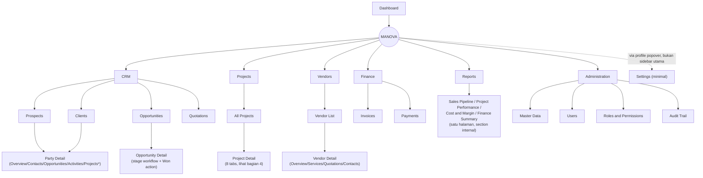

# Mockup Information Architecture — MANOVA (Prompt 3)

Status dokumen: **hasil finalisasi rancangan IA.** Tidak ada kode yang diubah, tidak ada halaman diimplementasikan, tidak ada rename massal, tidak ada fitur dihapus. Keputusan pada dokumen ini berstatus **LOCKED** kecuali ditandai lain — ini adalah tahap yang secara eksplisit diminta untuk "memfinalisasikan rancangan" (Prompt 3), berbeda dengan Prompt 2 yang murni gap analysis. Detail penuh tiap keputusan beserta alasannya ada di `docs/mockup-design-decisions.md`; ringkasan status per keputusan juga tercermin di sana.

Landasan: keputusan LOCKED Prompt 0, hasil gap analysis Prompt 2 (`docs/template-reuse-mapping.md`), dan resolusi open questions Prompt 2 (`docs/mockup-open-questions.md` — Q1–Q6 diselesaikan di tahap ini, ditandai `[RESOLVED]`).

---

## 1. Prinsip Penyusunan IA

Baseline struktur di Prompt 3 bagian A (Dashboard/CRM/Projects/Operations/Travelers/Vendors/Finance/Reports/Administration) **dievaluasi, bukan disalin mentah** — sesuai instruksi eksplisit "evaluasi apakah beberapa menu lebih tepat menjadi tab di Project Detail daripada menu global. Hindari menu terlalu dalam dan hindari halaman kosong."

Hasil evaluasi: dari 9 kelompok baseline, **2 kelompok (Operations, Travelers) diputuskan TIDAK menjadi menu top-level** karena secara alami selalu terikat konteks satu project (tidak ada kebutuhan bisnis yang disebut Prompt 0 untuk melihat itinerary/traveler lintas-project sebagai direktori independen di fase mockup ini) — keduanya menjadi tab di dalam Project Detail. Ini menghindari halaman global yang akan kosong/tipis di awal fase mockup.

**Vendors dipertahankan sebagai menu top-level** (berbeda perlakuan dari Operations/Travelers) karena vendor secara alami melayani banyak project sekaligus — direktori vendor lintas-project punya nilai bisnis nyata (reuse vendor yang sama di project berbeda, membandingkan harga antar project).

---

## 2. Sitemap (Navigation Tree Final)

*`Projects` (tab kondisional) hanya tampil di Party Detail bila party berstatus Client dan memiliki minimal 1 project.

**Perbandingan dengan sidebar existing:** 13 item flat (4 hidup, 9 dead link) → 7 kelompok menu top-level (beberapa dengan sub-item), lebih dangkal secara total link count namun lebih terorganisir. Lihat `docs/route-and-role-matrix.md` untuk pemetaan eksplisit dead-link lama → tujuan baru.

---

## 3. Navigation Tree — Penjelasan per Kelompok

### 3.1 Dashboard
Satu halaman (`/`), konten adaptif per role (lihat `docs/route-and-role-matrix.md` bagian Dashboard Role Behavior). Bukan menu bertingkat.

### 3.2 CRM
- **Prospects** (`/crm/prospects`) dan **Clients** (`/crm/clients`) adalah dua *filtered view* dari satu master data Party yang sama (lifecycle status `Prospect` vs `Client`) — **bukan dua tabel/dataset terpisah**, sesuai keputusan LOCKED Prompt 0 dan detail model di bagian 5. Dipertahankan sebagai 2 menu terpisah (bukan digabung jadi 1 "Parties") karena bahasa bisnis sehari-hari (Sales bicara "prospect saya", Finance/PM bicara "client saya") berbeda kebutuhan filter defaultnya.
- **Opportunities** (`/crm/opportunities`) — daftar opportunity lintas seluruh party, dikelompokkan per stage.
- **Quotations** (`/crm/quotations`) — daftar quotation lintas seluruh opportunity (agregat, berbeda dari tab Opportunities di Party Detail yang kontekstual per-party).
- **Contacts** dan **Activities** (baseline Prompt 3 A-2) **tidak menjadi menu top-level** — dievaluasi sebagai selalu-terikat-konteks-Party (contact person milik satu party, activity dicatat terhadap satu party/opportunity) → jadi tab di dalam **Party Detail**, bukan direktori global. Ini konsisten dengan instruksi "evaluasi tab vs menu global."

### 3.3 Projects
- **All Projects** (`/projects`) — satu daftar, tidak ada sub-menu tambahan.
- **Project Detail** (`/projects/[id]`) — pusat operasional, lihat bagian 4.
- **Project Changes**, **Project Documents**, **Project Tasks atau Timeline** (baseline Prompt 3 A-3) — **tidak menjadi route/menu terpisah**, seluruhnya menjadi tab di dalam Project Detail (lihat bagian 4) — konsisten dengan pola existing codebase (`projects/[id]/index.vue` sudah memakai satu file dengan tab internal, bukan nested route per tab).

### 3.4 Operations — **tidak menjadi menu top-level**
Seluruh sub-item baseline (Itineraries, Flights, Hotels, Transportation, MICE, Additional Services) melebur menjadi **satu tab "Itinerary & Services"** di dalam Project Detail, dengan sub-section yang **muncul kondisional** sesuai kombinasi layanan project (flight-only vs +hotel vs +transport vs MICE, sesuai 4 tipe project Prompt 0-B). Alasan: seluruh entitas operasional ini secara bisnis selalu terikat pada satu project spesifik; tidak ada kebutuhan eksplisit di Prompt 0 untuk direktori operasional lintas-project di fase mockup ini. Menghindari 5+ menu top-level yang masing-masing akan jadi daftar tipis/kosong sebelum ada banyak data project.

### 3.5 Travelers — **tidak menjadi menu top-level**
Seluruh sub-item baseline (Travelers, Participants, Groups, Rooming Lists) melebur menjadi **satu tab "Travelers"** di dalam Project Detail (dengan sub-view list/group/rooming-list). Alasan sama seperti Operations — traveler pada dasarnya adalah data milik satu project. Tidak ada kebutuhan direktori traveler lintas-project yang disebut eksplisit di Prompt 0.

### 3.6 Vendors — **dipertahankan sebagai menu top-level**
- **Vendor List** (`/vendors`) — direktori vendor lintas-project.
- **Vendor Detail** (`/vendors/[id]`) — tab Overview/Services/Quotations/Contacts.
- Vendor Services dan Vendor Quotations (baseline Prompt 3 A-6) menjadi tab di Vendor Detail, bukan menu top-level terpisah — alasan sama seperti Contacts/Activities di CRM (selalu kontekstual ke satu vendor).
- Assignment vendor ke project tetap terjadi di tab "Vendors" pada Project Detail (referensi ke direktori global, bukan duplikasi data).

### 3.7 Finance
- **Invoices** (`/finance/invoices`) dan **Payments** (`/finance/payments`) dipertahankan sebagai 2 menu top-level (kebutuhan Finance role melihat status lintas-project).
- **Outstanding** (baseline Prompt 3 A-7) **tidak menjadi menu terpisah** — jadi filter/section di dalam halaman Invoices (mis. tab "All / Outstanding" pada `/finance/invoices`), menghindari halaman tipis berdiri sendiri.
- **Project Budgets** dan **Costs** (baseline Prompt 3 A-7) **tidak menjadi menu top-level** — ini secara alami melekat per-project, jadi bagian tab "Finance" di Project Detail (gabungan Budget vs Actual + Invoice/Payment kontekstual project tsb).

### 3.8 Reports
Satu route (`/reports`) berisi 4 section (Sales Pipeline, Project Performance, Cost and Margin, Finance Summary) yang dipilih lewat switcher di dalam halaman (bukan 4 route terpisah) — menghindari 4 menu tipis yang isinya sama-sama "grafik ringkasan", dan visibilitas tiap section diatur oleh role (lihat `docs/route-and-role-matrix.md`).

### 3.9 Administration
Dipertahankan 4 sub-item sesuai baseline (Master Data, Users, Roles and Permissions, Audit Trail) — keempatnya cukup substansial sebagai halaman mandiri (bukan kandidat tab), tidak ada penyederhanaan lebih lanjut yang beralasan kuat.

### 3.10 Settings — **tidak masuk sidebar utama**
Resolusi open question Prompt 2 (Q5): Settings dipertahankan dalam skema minimal (info profil/akun) dan hanya diakses lewat popover profil user (`AppSidebar.vue` sudah punya tombol "Profile Settings" existing yang perlu tujuan) — tidak ditambahkan sebagai item sidebar utama karena isinya tidak cukup substansial untuk jadi menu top-level sendiri di fase mockup ini (menghindari "menu tanpa tujuan jelas").

---

## 4. Project Detail Structure (Pusat Operasional)

16 kandidat area dari Prompt 3 bagian C dikonsolidasikan menjadi **8 tab**, mengikuti instruksi "hindari tab berlebihan, gabungkan area yang seharusnya satu konteks":

| Tab final | Area yang digabung dari kandidat Prompt 3-C | Kondisional? |
|---|---|---|
| **Overview** | Overview | Selalu tampil |
| **Itinerary & Services** | Timeline, Itinerary, Flights, Hotels, Transportation, MICE | Selalu tampil sebagai tab; **sub-section di dalamnya kondisional** sesuai `project.serviceScope` (project flight-only hanya menampilkan section Flight; project Korea menampilkan Flight+Hotel+Transportation; project Palu menampilkan section MICE, dst. — mengikuti 4 tipe project Prompt 0-B) |
| **Travelers** | Travelers, Participants, Groups, Rooming Lists | Selalu tampil (setiap project punya traveler) |
| **Vendors** | Vendors | Selalu tampil |
| **Finance** | Budget and Cost, Invoice and Payment | Selalu tampil |
| **Tasks** | Tasks | Selalu tampil (basis: Kanban tab existing) |
| **Documents** | Documents | Selalu tampil (basis: Files tab existing) |
| **Activity & Changes** | Changes, Activity | Selalu tampil; internal filter toggle "All / Changes only" — data berasal dari satu sumber log yang sama (Activity/AuditTrail entry dengan flag `isChange`), bukan dua sumber data terpisah, agar High-Change Project (Prompt 0-G) menonjolkan entri perubahan tanpa membutuhkan tab kedelapan-belas |

**Alasan konsolidasi dari 6 tab existing (Overview/Kanban/Timeline/Finances/Files/Activity) menjadi 8 tab baru:** penambahan domain CRM→Project (Traveler, Vendor) yang sebelumnya tidak ada sama sekali di template; Timeline lama (task-oriented) dipecah konsepnya — "Timeline" jadi bagian dalam "Itinerary & Services" (jadwal perjalanan), sementara task tetap di tab "Tasks" (dari Kanban existing) — bukan penambahan sembarangan, tapi pemisahan tanggung jawab yang lebih jelas untuk domain travel.

**Keputusan teknis route (LOCKED):** tab-tab di atas **tetap satu route** `/projects/[id]` dengan state tab di sisi client (mengikuti pola existing `projects/[id]/index.vue` yang sudah begitu), **bukan nested route** (`/projects/[id]/itinerary`, dst., meski dicontohkan sebagai opsi di Prompt 3-B). Alasan: (1) pola coding existing yang sudah sehat dipertahankan (Prompt 0 aturan teknis #3); (2) menghindari overengineering untuk tahap mockup (Prompt 0 aturan teknis #7); (3) deep-link ke tab tertentu tetap dimungkinkan lewat query param (`?tab=itinerary`) tanpa perlu route terpisah.

---

## 5. Party, Prospect, dan Client (Model UI)

Mengonfirmasi dan merinci keputusan LOCKED Prompt 0/Prompt 2: **satu master data Party/Customer Account**, dibedakan lewat field `lifecycleStatus` (`Prospect` | `Client`), bukan dua tabel/entitas independen.

Alur yang didukung model ini:
1. Party dibuat dengan `lifecycleStatus = Prospect` (entry point: menu CRM > Prospects, atau otomatis saat Lead pertama kali di-capture — Lead sendiri adalah pre-Party record yang bisa dikonversi jadi Party+Prospect).
2. Prospect memiliki `ContactPerson[]` dan `Activity[]` — direpresentasikan sebagai tab di **Party Detail**, bukan tabel terpisah (lihat bagian 3.2).
3. Prospect dapat memiliki `Opportunity[]` — tab "Opportunities" di Party Detail, sekaligus muncul di daftar global `/crm/opportunities`.
4. Saat Opportunity milik party tsb menjadi **Won**, `lifecycleStatus` party otomatis berubah dari `Prospect` menjadi `Client` (bila belum berstatus Client) — **kondisi bisnis untuk transisi ini adalah: minimal satu Opportunity berstatus Won**. Transisi status ini bagian dari alur Opportunity-to-Project (bagian 6 `docs/route-and-role-matrix.md`), dieksekusi otomatis oleh sistem, bukan aksi manual terpisah.
5. **History Prospect tidak hilang setelah menjadi Client** — karena hanya field `lifecycleStatus` yang berubah pada record Party yang sama; seluruh `Activity`, `ContactPerson`, dan `Opportunity` lama tetap terhubung ke record Party yang sama, tetap terlihat di Party Detail tab masing-masing (Party Detail tidak berubah struktur tab saat status berubah, hanya tab "Projects" yang menjadi terisi/relevan).
6. Client dapat memiliki **beberapa Project** (tab "Projects" di Party Detail, kondisional muncul saat `lifecycleStatus = Client` dan minimal 1 project ada) dan **beberapa Contact Person** (tab "Contacts", tidak dibatasi satu).

Konsekuensi teknis (dicatat untuk implementasi, bukan diimplementasikan sekarang): field pembeda `Prospect` vs `Client` cukup satu enum `lifecycleStatus` pada type `Party`, bukan dua interface berbeda — mencegah kembali terjadinya "banyak shape untuk satu konsep" seperti temuan Project/Task/Expense di audit Prompt 1.

---

## 6. Demo Scope vs Deferred/Excluded Scope

### 6.1 Termasuk demo (seluruh IA final di atas)
Seluruh menu, route, dan tab yang dideskripsikan di bagian 2–5 termasuk dalam scope demo mockup MANOVA, dibangun bertahap mengikuti phasing Prompt 2 bagian I (Foundation → CRM → Opportunity to Project → Project Management → Vendor → Finance → Reporting → Administration → Regression and demo readiness — Operations dan Traveler sudah tidak lagi jadi phase terpisah dengan menu sendiri, isinya melebur ke phase Project Management sebagai bagian pengisian tab Project Detail).

### 6.2 Deferred (bukan dihapus, ditunda ke fase setelah mockup awal)
- Menu **Settings** versi lengkap (di luar profil minimal) — ditunda sampai ada kebutuhan konkret (preferensi tampilan, konfigurasi organisasi, dll.) yang tervalidasi.
- Direktori **Operations** dan **Travelers** lintas-project sebagai menu top-level mandiri — bisa dipertimbangkan lagi di fase setelah mockup awal bila kebutuhan agregasi lintas-project (mis. "semua traveler yang dokumennya belum lengkap di semua project") benar-benar muncul dari kebutuhan bisnis nyata, bukan diasumsikan sekarang.
- Detail halaman `Quotation` versi mandiri per-quotation (`/crm/quotations/[id]`) — untuk fase mockup awal, detail quotation cukup dilihat kontekstual dari tab "Opportunities" di Party Detail atau dari Opportunity Detail; halaman detail quotation mandiri ditunda sampai terbukti dibutuhkan.

### 6.3 Excluded (tidak jadi bagian IA MANOVA, dead link lama yang tidak dilanjutkan)
Rincian lengkap alasan per item ada di `docs/route-and-role-matrix.md` (tabel Route Inventory, kolom Status) dan `docs/template-reuse-mapping.md` bagian G:
- `/time-tracking` — tidak ada domain match di Prompt 0 manapun.
- `/templates` — fungsi tidak jelas, tidak ada kebutuhan eksplisit di Prompt 0; tidak difabrikasi fitur baru hanya untuk mengisi menu ini.
- `/integrations` — bertentangan langsung dengan larangan Prompt 0 (dilarang mengarang/mengklaim integrasi nyata).
- `/files` sebagai menu top-level mandiri — melebur jadi tab "Documents" di Project Detail.
- `/team` sebagai menu top-level mandiri — melebur ke `/admin/users` (Administration) dan info tim ringkas di tab Overview Project Detail.
- `/tasks` sebagai menu top-level mandiri — melebur jadi tab "Tasks" di Project Detail (resolusi Q2, lihat `docs/mockup-open-questions.md`).
- `/projects/create` sebagai entry point mandiri "buat project manual" — direpurpose jadi bagian konfirmasi otomatis alur Opportunity Won→Project (resolusi Q1, lihat bagian 6 `docs/route-and-role-matrix.md`), bukan lagi menu/tombol "New Project" independen dari CRM.
- `dashboard/AIAssistant.vue` — tidak ada mapping domain MANOVA di Prompt 0 manapun (resolusi Q6); tidak dilanjutkan sebagai bagian dashboard MANOVA. **Catatan:** ini keputusan IA (tidak masuk desain dashboard baru); penghapusan fisik file tetap menunggu tahap cleanup (Prompt 5), tidak dieksekusi sekarang.

---

## 7. Acceptance Check (self-verification terhadap Prompt 3-K)

- Tidak ada route utama yang ambigu — seluruh 9 kelompok baseline sudah dievaluasi eksplisit (dilanjutkan sebagai menu top-level, dilebur jadi tab, atau di-exclude dengan alasan).
- Sidebar structure jelas — 7 kelompok top-level, didetailkan di bagian 2–3.
- Project Detail structure jelas — 8 tab final, didetailkan di bagian 4.
- Tidak ada menu tanpa tujuan — setiap keputusan "tidak jadi menu top-level" disertai alasan bisnis (bagian 3.4, 3.5, 3.10) bukan sekadar disederhanakan dari nama.
- Tidak ada kode aplikasi yang diubah pada tahap ini.
