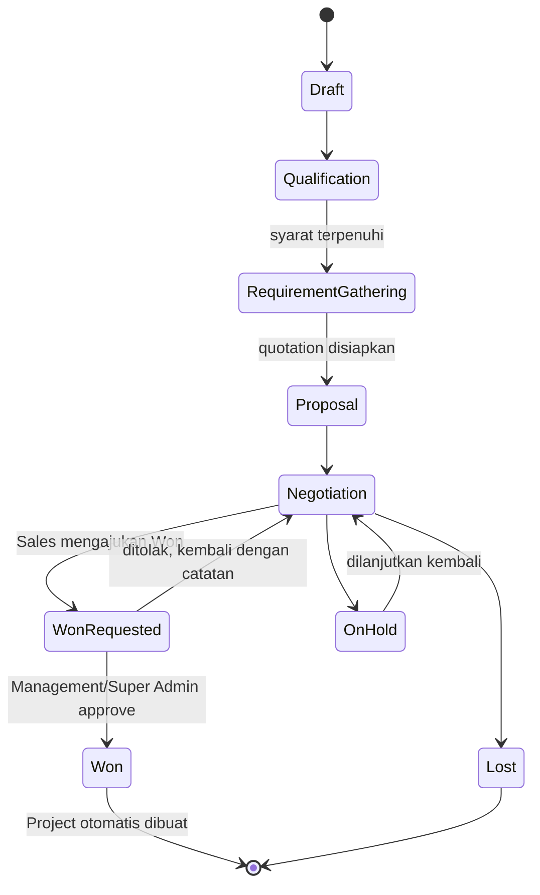
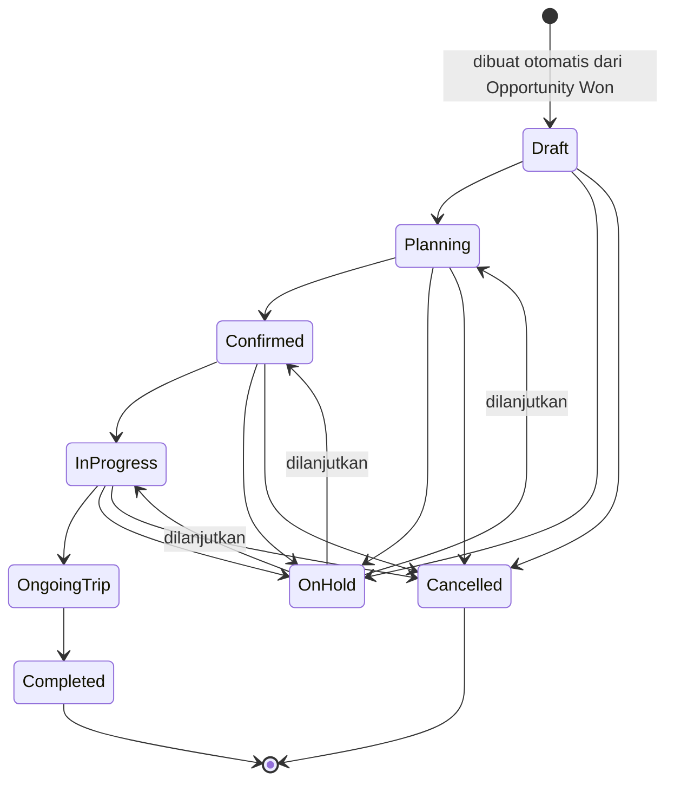
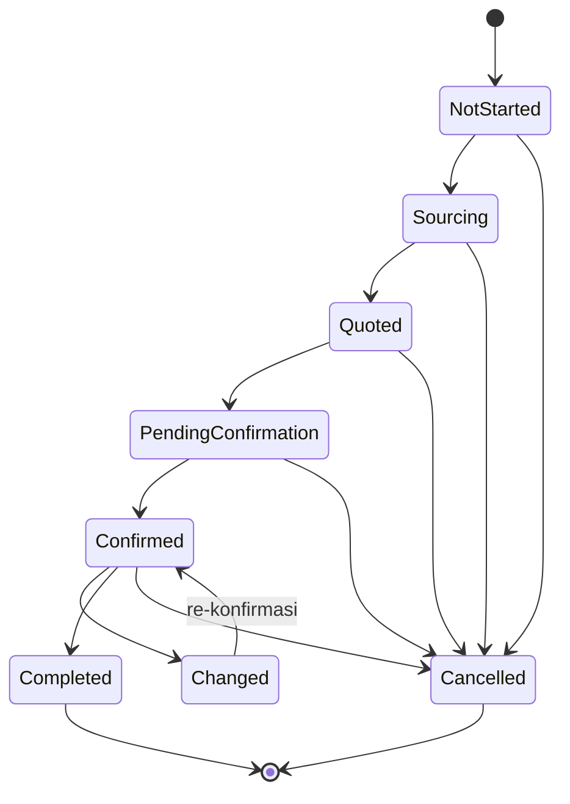

# Route and Role Matrix — MANOVA (Prompt 3, dilengkapi di Prompt 4, route diaktifkan di Prompt 5)

Status dokumen: hasil finalisasi rancangan (LOCKED kecuali ditandai lain). **Prompt 5 telah mengaktifkan foundation shell untuk seluruh route di bagian 0** — build sukses dan smoke-test SSR (11 route, seluruhnya HTTP 200) mengonfirmasi route benar-benar ada di codebase sekarang, bukan lagi rancangan murni.
Landasan: `docs/mockup-information-architecture.md` (bagian 2–6), `docs/template-reuse-mapping.md`, keputusan LOCKED Prompt 0, `docs/mockup-design-decisions.md`.

**Catatan penting soal kolom Status/Implementation phase di bawah:** nilai-nilai ini tetap menunjukkan **kapan fungsionalitas PENUH (CRUD, form, business logic) direncanakan selesai** — bukan berarti route belum ada. Prompt 5 membangun *foundation shell* untuk hampir seluruh route lebih awal dari fase penuhnya: sebagian sudah nyata (data dari fixture, misalnya `/crm/opportunities`, `/projects`, `/projects/[id]`, `/vendors`), sebagian masih `ModulePlaceholder` berlabel "Segera Hadir" (mis. `/crm/prospects`, `/finance/invoices`, `/reports`, seluruh `/admin/*`). Rincian mana yang shell-nyata vs placeholder ada di `docs/mockup-progress.md` entri Prompt 5.

---

## 0. Consolidated Route Summary (kolom wajib Prompt 4-H)

Tabel ringkas lintas seluruh route (detail per kolom Purpose/Required data ada di bagian 1). Kolom **Reuse source** merujuk komponen/pola existing yang dipakai ulang (detail lengkap silang-referensi ke `docs/template-reuse-mapping.md`); **Implementation phase** memakai penamaan fase dari `docs/template-reuse-mapping.md` bagian I (Foundation/CRM/Opportunity to Project/Project Management/Vendor/Finance/Reporting/Administration).

| Route | Module | Page | Menu placement | Demo inclusion | Role access (ringkas) | Main action | Reuse source | Implementation phase | Status |
|---|---|---|---|---|---|---|---|---|---|
| `/login` | Global | Login | Tidak di sidebar (publik) | Ya | Publik (pre-auth) | Login mock | `pages/login.vue` existing | Foundation | foundation |
| `/` | Global/Dashboard | Dashboard | Sidebar — Dashboard | Ya | Semua (widget kondisional per role) | Lihat ringkasan KPI lintas-domain | `StatsCard` + widget adaptasi | Foundation (shell) → Section 06 (final) | **selesai (Section 06)** |
| `/[...slug]` | Global | 404 | Tidak di sidebar | Ya | Semua | Go back / Go home | `pages/[...slug].vue` existing | Foundation | foundation |
| `/settings` | Global | Settings (minimal) | Popover profil, bukan sidebar | Ya (minimal) | Diri sendiri saja | Edit profil pribadi | Form existing (adaptasi kecil) | Foundation | phase later (minimal) / deferred (lengkap) |
| `/crm/prospects` | CRM | Prospects | Sidebar — CRM > Prospects | Ya | Sales:`MANAGE`, Management:`VIEW`, Viewer:`VIEW` (halaman: seluruh role dengan `crm:VIEW` bisa lihat — lihat catatan Section 07) | Search/filter/kelola Prospect | `pages/projects/index.vue` (pola table) | CRM | **selesai (Section 07)** |
| `/crm/clients` | CRM | Clients | Sidebar — CRM > Clients | Ya | Sales:`MANAGE`, Management/PM/Finance/Viewer:`VIEW` | Search/filter Client (tanpa aksi manual convert) | Sama seperti Prospects | CRM | **selesai (Section 07)** |
| `/crm/parties/[id]` | CRM | Party Detail | Kontekstual dari Prospects/Clients | Ya | Sama seperti parent list | Kelola Contacts/Opportunities/Activities/Projects* | Adaptasi arsitektur tab `projects/[id]/index.vue` | CRM | **selesai (Section 07)** — lihat `docs/mockup-section-reports/section-07-crm-party.md` |
| `/crm/opportunities` | CRM | Opportunities | Sidebar — CRM > Opportunities | Ya | Sales:`MANAGE`, Management:`APPROVE`, Viewer:`VIEW` | Kelola pipeline opportunity | Table + pipeline chart baru | CRM | **selesai (Section 08)** |
| `/crm/opportunities/[id]` | CRM | Opportunity Detail | Kontekstual dari Opportunities | Ya | Sales:`MANAGE` (s/d WonRequested), Management:`APPROVE` (Won final) | Submit as Won / Approve Won | Stepper adaptasi `create.vue` | Opportunity to Project | **selesai (Section 09)** |
| `/crm/quotations` | CRM | Quotations | Sidebar — CRM > Quotations | Ya | Sales:`MANAGE`, Finance/Management/Viewer:`VIEW` | Lihat/kelola quotation lintas opportunity | `pages/expenses.vue` (pola table) | CRM | phase later |
| `/projects` | Projects | All Projects | Sidebar — Projects | Ya | PM:`MANAGE`, Management:`APPROVE`, Sales/Ops/Ticketing/Accommodation/Transportation/MICE/Finance/Viewer:`VIEW` | Search/filter/sort project | `projects/index.vue` (card-grid dipertahankan — `ProjectsTable.vue` tetap tidak dipakai, lihat catatan Section 10) | Project Management | **selesai (Section 10)** |
| `/projects/[id]` | Projects | Project Detail | Kontekstual dari All Projects | Ya | Bervariasi per tab (bagian 5) | Kelola 8-tab project workspace | Arsitektur tab `projects/[id]/index.vue` existing | Project Management (shell) → seluruh phase domain (isi) | **Overview (Section 10), Travelers (Section 11), Itinerary & Services (Section 12), Vendors (Section 13) selesai** — tab Finance masih baseline Foundation, detail penuh menyusul Section 14-15 |
| `/projects/[id]/edit` | Projects | Edit Project | Kontekstual dari Project Detail | Ya | PM:`MANAGE`, Management:`APPROVE` | Edit info inti project | `projects/[id]/edit.vue` adaptasi | Project Management | phase later |
| `/vendors` | Vendors | Vendors | Sidebar — Vendors | Ya | Super Admin: `ADMIN`; seluruh role lain (termasuk Ops/Ticketing/Accommodation/Transportation/MICE/PM/Finance/Management): `VIEW` — lihat catatan implementasi Section 13 di bawah | Kelola direktori vendor | Table generic adaptasi | Vendor | **selesai (Section 13)** — lihat `docs/mockup-section-reports/section-13-vendor-management.md` |
| `/vendors/[id]` | Vendors | Vendor Detail | Kontekstual dari Vendors | Ya | Sama seperti parent | Kelola detail vendor | Adaptasi arsitektur tab (skala kecil) | Vendor | **selesai (Section 13)** |
| `/finance/invoices` | Finance | Invoices | Sidebar — Finance > Invoices | Ya | Finance:`MANAGE`, Management/PM/Viewer:`VIEW` | Kelola invoice + lihat outstanding | `pages/expenses.vue` (setelah bug `handleDelete` diperbaiki) | Finance | phase later |
| `/finance/payments` | Finance | Payments | Sidebar — Finance > Payments | Ya | Finance:`MANAGE`, Management/Viewer:`VIEW` | Kelola record payment | Table generic adaptasi | Finance | phase later |
| `/reports` | Reports | Reports | Sidebar — Reports | Ya | Bervariasi per section (bagian 6) | Lihat 4 section laporan | Chart wrapper baru (pola `BudgetChart.vue`) | Reporting | phase later |
| `/admin/master-data` | Administration | Master Data | Sidebar — Administration > Master Data | Ya | Super Admin:`ADMIN`, lainnya:`NONE` | Kelola master data | Table generic adaptasi | Administration | phase later |
| `/admin/users` | Administration | Users | Sidebar — Administration > Users | Ya | Super Admin:`ADMIN`, Management:`VIEW` | Kelola user & assignment role | Table generic adaptasi | Administration | phase later |
| `/admin/roles` | Administration | Roles and Permissions | Sidebar — Administration > Roles | Ya | Super Admin:`ADMIN`, Management:`VIEW` | Lihat/kelola role matrix | Komponen baru "Role Matrix" | Administration | phase later |
| `/admin/audit-trail` | Administration | Audit Trail | Sidebar — Administration > Audit Trail | Ya | Super Admin:`ADMIN`, Management/Viewer:`VIEW` | Lihat log aktivitas lintas modul | Adaptasi `RecentActivity.vue` (skala global) | Administration | phase later |

**Baris berikut ditambahkan Prompt 19 (Change Request, 2026-07-30) — lihat bagian 1.9 untuk detail lengkap:**

| Route | Module | Page | Menu placement | Demo inclusion | Role access (ringkas) | Main action | Reuse source | Implementation phase | Status |
|---|---|---|---|---|---|---|---|---|---|
| `/customer-journey` | Customer Journey | Customer Journey Dashboard | Sidebar — Customer Journey | Ya | Super Admin/Management/AE: penuh; Sales: terbatas Lead; PM/Finance/Viewer: `VIEW` | Ringkasan Lead/Opportunity pipeline | `StatsCard`/`StatusBreakdownList` (reuse Dashboard) | Change Request 19 | **selesai** |
| `/customer-journey/leads` | Customer Journey | Leads | Sidebar — Customer Journey > Leads | Ya | Sales/AE/Super Admin: `MANAGE`; lainnya dengan `crm` VIEW+: `VIEW` | Table/Kanban/Inbox, Qualify & Create Opportunity, Archive | `Sheet` primitive (baru dipakai pertama kali) + pola table/dialog existing | Change Request 19 | **selesai** |
| `/customer-journey/customers` | Customer Journey | Customers | Sidebar — Customer Journey > Customers | Ya | Sama seperti `Party` (D-050), **kecuali Sales** (lihat 1.9) | Lihat directory Company | Reuse `Party`/`Table` existing | Change Request 19 | **selesai** |
| `/customer-journey/customers/[id]` | Customer Journey | Customer Detail | Kontekstual dari Customers | Ya | Sama seperti parent | Overview/Contacts/Opportunities/Project Orders/Activities/Documents | Adaptasi arsitektur tab Party Detail | Change Request 19 | **selesai** |
| `/customer-journey/project-orders` | Customer Journey | Project Orders | Sidebar — Customer Journey > Project Orders | Ya | Sama seperti `Project` (D-050), **kecuali Sales** | Lihat seluruh Project Order | Reuse `Project`/`Table` existing | Change Request 19 | **selesai** |
| `/customer-journey/project-orders/[id]` | Customer Journey | Project Order Detail | Kontekstual dari Project Orders | Ya | Sama seperti parent | Overview/Financial/Documents/Activity | Adaptasi ringkas Project Workspace | Change Request 19 | **selesai** |
| `/customer-journey/lead-sources` | Customer Journey | Lead Source Recap | Sidebar — Customer Journey > Lead Source Recap | Ya | Sama seperti Customers/Project Orders, **kecuali Sales** | Rekap performa sumber lead | `StatusBreakdownList`/`Table` | Change Request 19 | **selesai** |
| `/activity-center` | Activity Center | Activity Center | Sidebar — Activity Center | Ya | **Super Admin saja** (narrow override, bukan `administration` generik) | Log lintas sistem | Adaptasi pola `/admin/audit-trail` | Change Request 19 | **selesai** |
| `/supplier` | Supplier Portal | Supplier Dashboard | Sidebar — Supplier Portal | Ya | Supplier: `MANAGE` (ter-isolasi `vendorId`); Super Admin: `ADMIN` (oversight, tanpa `vendorId` → tampil "tidak ada akses") | Ringkasan company sendiri | `StatsCard`/`SectionCard` | Change Request 19 | **selesai** |
| `/supplier/products` | Supplier Portal | Produk/Layanan Saya | Sidebar — Supplier Portal > Products | Ya | Sama seperti parent | Kelola katalog produk sendiri | Table generic + dialog | Change Request 19 | **selesai** |
| `/supplier/orders` | Supplier Portal | Assignment & Quotation Saya | Sidebar — Supplier Portal > Orders | Ya | Sama seperti parent (read-only) | Lihat assignment/quotation sendiri | Table generic | Change Request 19 | **selesai** |

*Tab "Projects" di Party Detail kondisional (lihat bagian 1.2).

Route yang **excluded** (tidak dilanjutkan) tercantum di bagian 1.8, tidak diulang di tabel ini karena tidak punya Module/Menu placement/Role access yang berlaku (justru itu alasan exclusion).

---

## 1. Route Inventory (Detail)

Kolom **Status** memakai 4 nilai sesuai Prompt 3-B: `foundation` (dibangun di fase Foundation atau merupakan shell dasar), `phase later` (dibangun di fase domain terkait, menyusul), `deferred` (ditunda, bukan prioritas mockup awal), `excluded` (tidak dilanjutkan sebagai bagian IA MANOVA).

### 1.1 Global

| Route | Page name | Parent menu | Purpose | Required data | Main reusable component | Access role | Demo? | Status |
|---|---|---|---|---|---|---|---|---|
| `/login` | Login | — | Autentikasi mock | `User` (mock) | `pages/login.vue` existing (adaptasi payload) | Semua (publik, sebelum login) | Ya | foundation |
| `/` | Dashboard | Dashboard | Ringkasan lintas-domain, konten kondisional per role | Agregasi CRM/Project/Finance/Operations | `StatsCard` + widget adaptasi (`BudgetChart`, `ExpenseCategories`, `RecentActivity`, `StatusBreakdownList`) | Semua role (isi berbeda per role, lihat bagian 6) | Ya | **selesai (Section 06)** — lihat `docs/mockup-section-reports/section-06-dashboard.md` |
| `/[...slug]` | 404 | — | Catch-all halaman tidak ditemukan | — | `pages/[...slug].vue` existing | Semua | Ya | foundation |
| `/settings` | Settings (minimal) | via profile popover, bukan sidebar | Profil/akun pribadi user login | `User` (current user) | Form existing (adaptasi kecil) | Semua (hanya data diri sendiri) | Ya, minimal | deferred (versi lengkap) / phase later (versi minimal) |

### 1.2 CRM

| Route | Page name | Parent menu | Purpose | Required data | Main reusable component | Access role | Demo? | Status |
|---|---|---|---|---|---|---|---|---|
| `/crm/prospects` | Prospects | CRM | Daftar Party dengan `lifecycleStatus=Prospect` | `Party[]` | Adaptasi table dari `pages/projects/index.vue` (search+filter) | Sales: `MANAGE`; Management: `VIEW`; Viewer: `VIEW`; lainnya: `NONE` | Ya | **selesai (Section 07)** |
| `/crm/clients` | Clients | CRM | Daftar Party dengan `lifecycleStatus=Client` | `Party[]` | Sama seperti Prospects | Sales: `MANAGE`; Management: `VIEW`; PM: `VIEW`; Finance: `VIEW`; Viewer: `VIEW`; lainnya: `NONE` | Ya | **selesai (Section 07)** |
| `/crm/parties/[id]` | Party Detail | CRM (dari Prospects/Clients) | Detail satu party: Overview/Contacts/Opportunities/Activities/Projects* | `Party`, `ContactPerson[]`, `Opportunity[]`, `Activity[]`, `Project[]` | Adaptasi arsitektur tab `projects/[id]/index.vue` | Sama seperti parent list | Ya | **selesai (Section 07)** |
| `/crm/opportunities` | Opportunities | CRM | Daftar seluruh opportunity, dikelompokkan per stage | `Opportunity[]` | Table + widget pipeline baru (`StatusBreakdownList` reuse dari Section 06, bukan Chart.js baru) | Sales: `MANAGE`; Management: `APPROVE`; Viewer: `VIEW`; lainnya: `NONE` | Ya | **selesai (Section 08)** — lihat `docs/mockup-section-reports/section-08-opportunity-quotation.md` |
| `/crm/opportunities/[id]` | Opportunity Detail | CRM | Detail satu opportunity: stage stepper, quotation, aksi Won/Lost | `Opportunity`, `Quotation`, `Party` | Badge stepper sederhana (bukan adaptasi `create.vue` — lihat catatan Section 08) | Sales: `MANAGE` (hingga status "Won-Requested"); Management: `APPROVE` (final Won); Viewer: `VIEW` | Ya | **selesai (Section 09)** — Approve/Reject Won + pembuatan Project otomatis kini aktif, lihat `docs/mockup-section-reports/section-09-opportunity-won-to-project.md` |
| `/crm/quotations` | Quotations | CRM | Daftar seluruh quotation lintas opportunity | `Quotation[]` | Adaptasi table `pages/expenses.vue` | Sales: `MANAGE`; Finance: `VIEW`; Management: `VIEW`; Viewer: `VIEW` | Ya | phase CRM |

*Tab "Projects" di Party Detail hanya tampil bila `lifecycleStatus=Client` dan minimal 1 project ada — lihat `docs/mockup-information-architecture.md` bagian 5.

**Catatan implementasi Section 07 (klarifikasi akses halaman vs akses tulis, bukan perubahan keputusan LOCKED):** kolom "Access role" di atas adalah granularity per-route yang dirancang di Prompt 3. Implementasi aktual memakai dua lapis: (1) **akses buka halaman** memakai `usePermissions().canView('crm')` — satu source of truth per-modul (`ROLE_MODULE_ACCESS`, D-030) yang sudah dipakai sejak Section 05/06, sedikit lebih luas dari tabel di atas karena PM dan Finance memegang `crm:VIEW` di level modul (dibutuhkan untuk konteks Project/Invoice yang mereferensikan Party); (2) **akses tulis** (buat Prospect, tambah Contact/Activity) memakai pengecualian sempit `canManageParty = Sales atau Super Admin`, persis sesuai tabel di atas — Management **tidak** bisa membuat/mengubah Prospect meski modul `crm`-nya berperingkat `APPROVE` (dipakai khusus approve Opportunity Won, Section 09), karena `canManage('crm')` generik tidak cukup presisi untuk kasus ini. Lihat `docs/mockup-section-reports/section-07-crm-party.md`.

**Catatan implementasi Section 08 (Opportunity dan Quotation):**
- Pola akses tulis yang sama seperti Section 07 dipakai lagi: `canManageOpportunity = Sales atau Super Admin`, mengecualikan Management secara sengaja (docs bagian 1.2).
- "Table + widget pipeline baru (Chart.js wrapper baru)" di rancangan awal **diimplementasikan dengan reuse `StatusBreakdownList`** (shared component Section 06), bukan wrapper Chart.js baru — cukup untuk breakdown per-stage, menghindari duplikasi komponen chart.
- "Stepper adaptasi `create.vue`" di rancangan awal **diimplementasikan sebagai rangkaian `StatusBadge` sederhana** (bukan adaptasi literal wizard `pages/projects/create.vue`) — lebih ringan dan cukup untuk menunjukkan progres stage linear + cabang Lost/On Hold; didokumentasikan sebagai penyederhanaan yang disengaja, bukan penyimpangan diam-diam.
- `Opportunity` diperluas dengan field `ownerId`, `estimatedValueIdr`, `destination`, `travelStartDate`/`travelEndDate` (opsional), `travelerEstimate` (opsional), `requirementNotes` (opsional) — dibutuhkan langsung oleh scope eksplisit Section 08 ("Owner, value, requirement, destination, travel date, traveler estimate"). `Quotation` diperluas dengan `version`/`supersededAmountIdr` untuk "quotation version mock" ringan.
- Model Won penuh (approve + pembuatan Project) sengaja **tidak** diimplementasikan — hanya submit ke `WonRequested` yang aktif, sesuai hard rule "Workflow Won penuh dikerjakan pada Section 09".

Lihat `docs/mockup-section-reports/section-08-opportunity-quotation.md` untuk detail lengkap.

### 1.3 Projects

| Route | Page name | Parent menu | Purpose | Required data | Main reusable component | Access role | Demo? | Status |
|---|---|---|---|---|---|---|---|---|
| `/projects` | All Projects | Projects | Daftar seluruh project | `Project[]` | `pages/projects/index.vue` (card-grid) — **lihat catatan Section 10:** `dashboard/ProjectsTable.vue` sengaja **tidak** dipakai/disatukan, tetap dicadangkan | PM: `MANAGE`; Management: `APPROVE` (perubahan besar/cancel); Sales: `VIEW` (project dari opportunity miliknya); Operations/Ticketing/Accommodation/Transportation/MICE: `VIEW` (project yang di-assign); Finance: `VIEW`; Viewer: `VIEW` | Ya | **selesai (Section 10)** — lihat `docs/mockup-section-reports/section-10-project-core.md` |
| `/projects/[id]` | Project Detail | Projects (dari All Projects) | Pusat operasional, 8 tab (lihat `docs/mockup-information-architecture.md` bagian 4) | Seluruh entitas terkait project | Arsitektur tab `projects/[id]/index.vue` existing (dipertahankan strukturnya) | Bervariasi per tab (lihat bagian 4 Role Matrix di bawah) | Ya | **Overview (Section 10), Travelers (Section 11), Itinerary & Services (Section 12) selesai** — tab lain diisi bertahap per phase domain (Section 13-15) |
| `/projects/[id]/edit` | Edit Project | Projects (kontekstual dari Project Detail) | Edit info inti project (bukan wizard create manual) | `Project` | Adaptasi `projects/[id]/edit.vue` (dirty-tracking pattern dipertahankan) | PM: `MANAGE`; Management: `APPROVE` (perubahan signifikan) | Ya | phase Project Management |

**Catatan implementasi Section 11 (Traveler and Participant, klarifikasi granularity akses tab, bukan perubahan keputusan LOCKED):**
- Pola akses tulis yang sama seperti Section 07/08 dipakai lagi untuk tab "Travelers": `canManageTravelers = Project Manager atau Super Admin`, mengecualikan Management secara sengaja — akses modul `project` generik Management adalah `APPROVE` (bagian 5) khusus untuk "perubahan besar/cancel project", bukan CRUD rutin data traveler.
- "Add/edit/remove/import mock" diimplementasikan penuh untuk entitas `Traveler`; CRUD untuk `TravelerGroup` (buat group baru) **sengaja tidak** ditambahkan pada tahap ini — 3 group demo (Management/Sales Team/Partner-VIP, skenario PRJ-103) sudah cukup mendemonstrasikan konsep group, dan hard rule scope literal hanya menyebut "Add/edit/remove/import mock" untuk traveler/participant, bukan group.
- "Import mock" disimulasikan sebagai penambahan baris traveler dengan data dokumen kosong (butuh dilengkapi manual) — bukan parsing file sungguhan, sesuai larangan fabrikasi integrasi nyata (D-006).
- Profil traveler bernama adalah **sampel representatif**, bukan 1:1 dengan `project.travelerCount` (6/18/60) — didokumentasikan transparan di `docs/mockup-data-scenarios.md` bagian 4e, melanjutkan pola `TRV-1031` yang sejak Foundation sudah merepresentasikan sebagian dari 60 traveler PRJ-103.

**Catatan implementasi Section 12 (Itinerary and Operations, klarifikasi granularity role per sub-section — merealisasikan bagian 5 secara presisi, bukan perubahan keputusan LOCKED):**
- `canManageServiceType(type)` — PM, Operations, Super Admin dapat mengelola SELURUH sub-section tab "Itinerary & Services" ("koordinasi umum" sesuai definisi Operations bagian 5); Ticketing/Accommodation/Transportation/MICE hanya `MANAGE` pada sub-section sesuai domainnya masing-masing (Flight/Hotel/Transportation/MICE) — tidak bisa mengubah status service tipe lain. Tipe `additional` tidak punya role sub-domain khusus (hanya PM/Operations/Super Admin).
- "Daily itinerary" diimplementasikan sebagai list read-only dikelompokkan per tanggal (pola `divide-y` existing, bukan komponen kalender baru — tidak ada library kalender terpasang, konsisten D-036) — tidak ada CRUD untuk entitas ini karena tidak diminta eksplisit di scope literal Section 12 (berbeda dari Traveler Section 11 yang eksplisit meminta "add/edit/remove/import mock").
- "Update Status" per service (select dropdown, role-gated) ditambahkan sebagai satu-satunya aksi tulis di tab ini — transisi ke status `changed` otomatis mencatat entri di `ACTIVITIES` (dibaca bersama oleh tab "Activity & Changes"), mendemonstrasikan "Change markers untuk High-Change Project" tanpa membuat log paralel baru.
- "Additional service" (kategori kelima di luar Flight/Hotel/Transportation/MICE) diimplementasikan sebagai tipe `ServiceTypeKey` baru yang **tidak pernah** masuk `Project.serviceScope` (tetap 4 kombinasi resmi Prompt 0-B) — visibilitas section-nya murni data-driven (ada/tidaknya baris service bertipe itu untuk project tsb), bukan bagian klasifikasi tipe project formal.

### 1.4 Vendors

| Route | Page name | Parent menu | Purpose | Required data | Main reusable component | Access role | Demo? | Status |
|---|---|---|---|---|---|---|---|---|
| `/vendors` | Vendors | Vendors | Direktori vendor lintas-project | `Vendor[]` | Adaptasi table generic | Super Admin: `ADMIN`; seluruh role lain: `VIEW` (lihat catatan implementasi Section 13) | Ya | **selesai (Section 13)** |
| `/vendors/[id]` | Vendor Detail | Vendors | Detail vendor: Overview/Services/Quotations/Contacts | `Vendor`, `VendorContact[]`, `VendorQuotation[]`, `VendorActivity[]` | Adaptasi arsitektur tab (skala lebih kecil dari Party/Project Detail) | Sama seperti parent list | Ya | **selesai (Section 13)** |

**Catatan implementasi Section 13 (Vendor Management, koreksi dokumentasi — bukan perubahan keputusan LOCKED):** baris di atas sebelumnya (Prompt 3) mencantumkan "Operations/Ticketing/Accommodation/Transportation/MICE: `MANAGE` (sesuai sub-domain masing-masing)" untuk modul Vendor. Ini **tidak pernah diimplementasikan dan bertentangan dengan kode yang sudah berjalan sejak Section 05** (`app/constants/roles.ts`, `ROLE_MODULE_ACCESS.vendor`) — yang secara konsisten memberi `VIEW` untuk seluruh role tsb (dan `PM`/`Finance`/`Management`), `ADMIN` hanya untuk Super Admin, persis sama dengan Role & Access Matrix bagian 5 (kolom Vendor) yang **juga** sudah begitu sejak Prompt 3 finalisasi. Bagian 0/1.4 (versi lama) tidak sinkron dengan bagian 5 dan kode — dikoreksi di sini agar dokumen konsisten dengan implementasi aktual, bukan keputusan baru. Sesuai `docs/mockup-change-impact-log.md` CI-015: karena Vendor module rank tidak punya isu "rank generik membocorkan akses" seperti CRM/Project (Management di modul lain punya `APPROVE` > `MANAGE`), Section 13 **tidak** membutuhkan pengecualian sempit tambahan (`canManageParty`/`canManageTravelers`-style) — `canManage('vendor')` generik sudah presisi (Super Admin saja).
Aksi Accept/Reject quotation (menentukan vendor mana yang ditugaskan ke satu service) digerbangi terpisah oleh `canManageServiceType` (Section 12, reuse) karena aksi ini pada dasarnya adalah keputusan **Project domain** (menulis `ProjectService.vendorId`), bukan Vendor domain murni — memungkinkan Ticketing/Accommodation/Transportation/MICE menerima quotation untuk sub-section mereka sendiri, sekaligus tetap konsisten dengan matrix Project bagian 5 yang sudah LOCKED.

### 1.5 Finance

| Route | Page name | Parent menu | Purpose | Required data | Main reusable component | Access role | Demo? | Status |
|---|---|---|---|---|---|---|---|---|
| `/finance/invoices` | Invoices | Finance | Daftar invoice lintas-project + filter Outstanding | `Invoice[]` | Adaptasi `pages/expenses.vue` (table+filter+modal+toast, setelah bug `handleDelete` diperbaiki) | Finance: `MANAGE`; Management: `VIEW`; PM: `VIEW` (invoice project miliknya); Viewer: `VIEW` | Ya | phase Finance |
| `/finance/payments` | Payments | Finance | Daftar payment lintas-project | `Payment[]` | Adaptasi table generic | Finance: `MANAGE`; Management: `VIEW`; Viewer: `VIEW` | Ya | phase Finance |

### 1.6 Reports

| Route | Page name | Parent menu | Purpose | Required data | Main reusable component | Access role | Demo? | Status |
|---|---|---|---|---|---|---|---|---|
| `/reports` | Reports | Reports | 6 section granular dalam satu halaman (realisasi Section 16 dari scope literal Prompt 16 — lihat catatan implementasi di bawah): Sales Pipeline, Project Performance, Upcoming Departure dan Service Readiness, Vendor Summary, Budget vs Actual dan Margin, Invoice Aging dan Outstanding | Agregasi lintas-modul, murni read-only atas fixture/selektor existing | `StatusBreakdownList`, `BudgetChart`, `StatsCard`, `Table*` (seluruhnya reuse, tidak ada chart wrapper baru) | Section terlihat per role — lihat detail di bagian 6 dan catatan implementasi Section 16 di bawah | Ya | **selesai (Section 16)** — lihat `docs/mockup-section-reports/section-16-reports.md` |

**Catatan implementasi Section 16 (Reports, realisasi granularity — bukan perubahan keputusan LOCKED bagian 5, murni klarifikasi karena bagian 5 hanya memetakan 4 nama section sedangkan scope literal final Prompt 16 berisi 6 item):** pemetaan role per section granular:

| Section | Role dengan akses |
|---|---|
| Sales Pipeline | Sales, Management, Super Admin, Viewer (persis baris LOCKED bagian 5) |
| Project Performance | Project Manager, Management, Super Admin, Viewer (persis baris LOCKED bagian 5) |
| Upcoming Departure dan Service Readiness | Project Manager, Management, Super Admin, Viewer (dianggap bagian cakupan "Project Performance" untuk PM; Operations/Ticketing/Accommodation/Transportation/MICE **tidak** melihatnya di Reports meski melihat info serupa di Dashboard — `ROLE_MODULE_ACCESS.reports` mereka `NONE`, LOCKED sejak Foundation) |
| Vendor Summary | Project Manager, Finance, Management, Super Admin, Viewer (section baru tanpa baris LOCKED persis — PM karena mengelola assignment vendor per project/Section 13, Finance karena committed vendor cost adalah komponen budget/margin) |
| Budget vs Actual dan Margin | Finance, Management, Super Admin, Viewer (persis baris LOCKED "Cost and Margin"; PM tidak termasuk) |
| Invoice Aging dan Outstanding | Finance, Management, Super Admin, Viewer (persis baris LOCKED "Finance Summary") |

Gerbang module-level halaman (`canView('reports')`) tidak berubah — Operations/Ticketing/Accommodation/Transportation/MICE tetap `NONE`, melihat `RoleAccessState`.

### 1.7 Administration

| Route | Page name | Parent menu | Purpose | Required data | Main reusable component | Access role | Demo? | Status |
|---|---|---|---|---|---|---|---|---|
| `/admin/master-data` | Master Data | Administration | Kelola daftar master (kategori, unit, dsb.) lintas modul | `MasterDataItem[]` | Adaptasi table generic | Super Admin: `ADMIN`; lainnya: `NONE` | Ya | phase Administration |
| `/admin/users` | Users | Administration | Kelola user & assignment role | `User[]`, `Role` | Adaptasi table generic | Super Admin: `ADMIN`; Management: `VIEW`; lainnya: `NONE` | Ya | phase Administration |
| `/admin/roles` | Roles and Permissions | Administration | Role matrix & permission mock (representasi visual dari bagian 4 dokumen ini) | `Role[]`, `Permission[]` | Komponen baru "Role Matrix" (tabel besar, berbasis `ui/table`) | Super Admin: `ADMIN`; Management: `VIEW`; lainnya: `NONE` | Ya | phase Administration |
| `/admin/audit-trail` | Audit Trail | Administration | Log aktivitas sistem lintas-modul | `AuditTrailEntry[]` | Adaptasi `dashboard/RecentActivity.vue` (skala global) | Super Admin: `ADMIN`; Management: `VIEW`; Viewer: `VIEW`; lainnya: `NONE` | Ya | phase Administration |

### 1.8 Route Lama yang Tidak Dilanjutkan (excluded, referensi silang ke IA bagian 6.3)

| Route lama | Nasib | Alasan |
|---|---|---|
| `/tasks` (top-level) | Excluded — melebur ke tab "Tasks" di `/projects/[id]` | Resolusi Q2 (`docs/mockup-open-questions.md`) — menghindari duplikasi konsep task lintas 2 tempat |
| `/projects/create` (entry point mandiri) | Excluded sebagai menu/tombol "New Project" independen — logic wizard direpurpose jadi konfirmasi otomatis alur Won→Project (bagian 2 di bawah) | Resolusi Q1 — Project harus lahir dari Opportunity Won (LOCKED Prompt 0), bukan dibuat manual bebas |
| `/files` (top-level) | Excluded — melebur ke tab "Documents" di Project Detail | Konsisten dengan evaluasi IA bagian 3.3 |
| `/team` (top-level) | Excluded — melebur ke `/admin/users` + info tim di tab Overview Project Detail | Tidak ada kebutuhan direktori tim lintas-project mandiri |
| `/time-tracking` | Excluded | Tidak ada domain match di Prompt 0 |
| `/templates` | Excluded | Fungsi tidak jelas, tidak difabrikasi fitur baru |
| `/integrations` | Excluded | Bertentangan dengan larangan mengarang integrasi nyata (Prompt 0-C) |

---

### 1.9 Customer Journey (Prompt 19 — Change Request)

| Route | Page name | Parent menu | Purpose | Required data | Main reusable component | Access role | Demo? | Status |
|---|---|---|---|---|---|---|---|---|
| `/customer-journey` | Customer Journey Dashboard | Customer Journey | Hub + ringkasan Lead/Opportunity pipeline | `Lead[]`, `Opportunity[]`, `Party[]` | `StatsCard`/`StatusBreakdownList` | Lihat bagian 5 (baris baru) | Ya | **selesai** |
| `/customer-journey/leads` | Leads | Customer Journey | Table/Kanban/Inbox, screening/qualification | `Lead[]`, `LeadActivity[]` | `Sheet` (drawer, baru dipakai), `Tabs` | Sales/AE/Super Admin: `MANAGE` (narrow exception `canManageLead`); role `crm` VIEW+ lain: `VIEW` | Ya | **selesai** |
| `/customer-journey/customers` | Customers | Customer Journey | Directory Company (= `Party`, D-050) | `Party[]` | Table generic | Sama seperti `crm` VIEW+ **kecuali Sales** (`roles` override nav, lihat bagian 5) | Ya | **selesai** |
| `/customer-journey/customers/[id]` | Customer Detail | Customer Journey | Overview/Contacts/Opportunities/Project Orders/Activities/Documents | `Party`, `ContactPerson[]`, `Opportunity[]`, `Project[]`, `PartyActivity[]`, `ProjectDocument[]` | Adaptasi arsitektur tab Party Detail | Sama seperti parent | Ya | **selesai** |
| `/customer-journey/project-orders` | Project Orders | Customer Journey | Seluruh Project Order (= `Project`, D-050) | `Project[]` | Table generic | Sama seperti parent | Ya | **selesai** |
| `/customer-journey/project-orders/[id]` | Project Order Detail | Customer Journey | Overview/Financial/Documents/Activity | `Project`, `Opportunity`, `Quotation`, `ActivityEntry[]`, `ProjectDocument[]` | Adaptasi ringkas Project Workspace | Sama seperti parent; Financial hanya `canViewFinancials` | Ya | **selesai** |
| `/customer-journey/lead-sources` | Lead Source Recap | Customer Journey | Rekap performa sumber lead | `Lead[]`, `Opportunity[]` | `StatusBreakdownList`/Table | Sama seperti Customers/Project Orders | Ya | **selesai** |

**Catatan implementasi:** Customers/Project Orders/Lead Source Recap **bukan** entitas/dataset baru (D-050) — 100% reuse `PARTIES`/`PROJECTS`/`OPPORTUNITIES` existing dengan lensa Account Executive-centric. Sales dibatasi ke Leads saja (literal Prompt 19-10 "Sales: terbatas pada Lead sesuai role matrix") — direalisasikan via 2 lapis: (1) nav item `roles` override (`app/constants/navigation.ts`, lihat D-052) sehingga link tidak tampil di sidebar; (2) page-level guard `canView('crm') && currentRole !== 'sales'` pada ketiga halaman tsb (defense in depth, akses langsung via URL tetap diblokir).

### 1.10 Activity Center (Prompt 19 — Change Request)

| Route | Page name | Parent menu | Purpose | Required data | Main reusable component | Access role | Demo? | Status |
|---|---|---|---|---|---|---|---|---|
| `/activity-center` | Activity Center | — (top-level) | Log lintas sistem (lead/opportunity/quotation/client/project-order/vendor/finance/user) | `SystemEvent[]` (baru) | Adaptasi pola `/admin/audit-trail` (stat tile + filter + list) | **Super Admin saja** — narrow `roles` override di nav DAN page-level (`currentRole === 'super-admin'`), BUKAN `canView('administration')` generik (yang juga memberi Management/Viewer `VIEW`, dipakai `/admin/audit-trail`) | Ya | **selesai** |

**Catatan implementasi:** `SystemEvent` terpisah dari `ActivityEntry` (tab "Activity & Changes" Project Detail, LOCKED sejak Section 05/14, tidak disentuh) — log level-atas lintas modul, bukan pengganti/duplikasi log level-Project.

### 1.11 Supplier Portal / External Partners (Prompt 19 — Change Request)

| Route | Page name | Parent menu | Purpose | Required data | Main reusable component | Access role | Demo? | Status |
|---|---|---|---|---|---|---|---|---|
| `/supplier` | Supplier Dashboard | Supplier Portal | Ringkasan company sendiri | `Vendor` (1, ter-scope), `ProjectService[]`, `VendorQuotation[]`, `VendorProduct[]` | `StatsCard`/`SectionCard` | `supplier`: `MANAGE` (modul `supplier-portal`, D-048); `super-admin`: `ADMIN` (tapi tanpa `vendorId` → `RoleAccessState`, tidak bocor data vendor manapun) | Ya | **selesai** |
| `/supplier/products` | Produk/Layanan Saya | Supplier Portal | Kelola katalog produk/layanan sendiri | `VendorProduct[]` (ter-scope) | Table generic + create-dialog | Sama seperti parent | Ya | **selesai** |
| `/supplier/orders` | Assignment & Quotation Saya | Supplier Portal | Lihat assignment/quotation sendiri (read-only, lihat Q12) | `ProjectService[]`, `VendorQuotation[]` (ter-scope) | Table generic | Sama seperti parent | Ya | **selesai** |

**Catatan implementasi (isolasi vendor, hard rule literal Prompt 19-1):** seluruh 3 halaman WAJIB memfilter data lewat `usePermissions().vendorScopeId` (`User.vendorId` milik user login) — tidak pernah membaca `VENDORS`/`PROJECT_SERVICES`/`VENDOR_QUOTATIONS`/`VENDOR_PRODUCTS` penuh. Modul `supplier-portal` **terpisah** dari modul `vendor` existing (direktori vendor internal, dilihat seluruh role internal — TIDAK diberikan ke role `supplier`, `ROLE_MODULE_ACCESS.supplier.vendor = 'NONE'`, mencegah supplier melihat direktori vendor lain). Tab "Products" baru ditambahkan ke `/vendors/[id]` (existing) — sumber data yang sama (`VendorProduct`) tampil baik dari sisi internal maupun `/supplier/products`.

---

## 2. Opportunity-to-Project Workflow

### 2.1 Stage Opportunity

**Catatan penting (LOCKED):** stage `WonRequested` adalah **tambahan** di luar daftar baseline Prompt 3-E (Draft/Qualification/Requirement Gathering/Proposal/Negotiation/Won/Lost/On Hold) — ditambahkan sebagai *internal gate*, bukan stage yang terlihat sebagai pipeline utama bagi Sales (bagi Sales, aksi yang terlihat cukup "Ajukan sebagai Won"). Alasan penambahan dijelaskan di bagian 2.3 (role model). Ini bukan penambahan fitur di luar konteks — murni mekanisme approval untuk memenuhi instruksi Prompt 3-E: *"Hak mengubah Opportunity menjadi Won harus mengikuti role dan permission yang masuk akal ... Pilih model paling sederhana yang tetap realistis untuk demo."*

### 2.2 Efek Opportunity → Won (checklist, seluruhnya LOCKED sesuai Prompt 3-E)

Saat Management/Super Admin menyetujui `WonRequested` → `Won`:

1. **Project otomatis dibuat** — record `Project` baru dengan status awal `Draft` (lihat bagian 3).
2. **Referensi opportunity disimpan** — `project.opportunityId` mengarah ke `Opportunity` asal.
3. **Client terhubung ke project** — `project.partyId` = party dari opportunity; bila `party.lifecycleStatus` masih `Prospect`, otomatis berubah jadi `Client` (bagian 5 `docs/mockup-information-architecture.md`).
4. **Data dasar project diambil dari opportunity** — judul, destinasi, tanggal perkiraan, estimasi jumlah traveler disalin sebagai nilai awal (bukan referensi live — bisa diedit terpisah setelahnya).
5. **Service scope awal dibawa ke project** — flag flight/hotel/transportation/MICE dari quotation yang disetujui menjadi `project.serviceScope` awal, menentukan sub-section apa saja yang aktif di tab "Itinerary & Services".
6. **Initial budget/quotation reference dibawa** — `project.initialBudget` diisi dari nilai quotation yang di-Won-kan, dan `project.sourceQuotationId` disimpan sebagai referensi.
7. **Activity log mencatat perubahan** — entri baru di log (dipakai bersama oleh tab "Activity & Changes" Project Detail dan `/admin/audit-trail`): "Project {kode} dibuat dari Opportunity {kode} (Won oleh {approver})".
8. **User menerima feedback keberhasilan** — toast/notifikasi konfirmasi "Project berhasil dibuat" dengan tautan langsung ke Project Detail yang baru (pola toast sudah ada di `pages/expenses.vue`, direuse).

### 2.3 Role Model untuk Aksi Won (LOCKED, dengan alasan)

**Model yang dipilih:** two-step gate — **Sales mengajukan** ("Submit as Won"), **Management atau Super Admin menyetujui** ("Approve Won") yang benar-benar mengeksekusi efek di atas.

**Alasan pemilihan model ini (bukan model lain yang dipertimbangkan):**
- Daftar role Prompt 3-H tidak menyediakan role terpisah "Sales Manager" — hanya "Management" sebagai role approval tertinggi di bawah Super Admin. Model dua-langkah dengan approver = Management/Super Admin memakai role yang memang sudah tersedia di daftar, tidak mengarang role baru.
- Model "Sales bisa langsung Won tanpa approval" ditolak karena berlawanan dengan instruksi eksplisit Prompt 3-E: *"Approval atau final win dapat dilakukan oleh Sales Manager, Management, atau role tertentu"* — mengindikasikan ada pihak selain Sales yang harus terlibat pada momen krusial ini (momen yang men-trigger pembuatan Project + alokasi budget).
- Model "approval berjenjang berdasarkan nilai/kompleksitas opportunity" (mis. di bawah threshold nilai tertentu Sales bisa langsung Won, di atasnya perlu approval) **dipertimbangkan tapi tidak dipilih** untuk versi pertama karena menambah kompleksitas (perlu definisi threshold nilai/kompleksitas yang belum ada dasarnya di Prompt 0) — ini melanggar instruksi "pilih model paling sederhana yang tetap realistis". **Dicatat sebagai kemungkinan evolusi model di masa depan**, bukan dihapus dari pertimbangan (lihat `docs/mockup-open-questions.md` bila ingin divalidasi ke depannya).
- Model ini tetap "realistis untuk demo" karena mencerminkan pola bisnis B2B yang umum: sales mengajukan, atasan/manajemen menyetujui deal besar — sekaligus cukup sederhana untuk disimulasikan dengan mock role check tanpa logic bercabang berlebihan.

**Catatan implementasi Prompt 19 (Change Request, amandemen — bukan mengubah model dua-langkah di atas):** "Sales mengajukan" pada narasi di atas kini dilakukan oleh **Account Executive** (peran baru yang mengambil alih pengelolaan Opportunity/Quotation dari Sales — D-047, `docs/mockup-design-decisions.md`); "Management/Super Admin menyetujui" tidak berubah. Ditambahkan satu lapis baru **sebelum** "Submit as Won": **Commercial Approval** pada Quotation (AE submit → Management approve/reject nilai/discount/margin/payment terms/service scope/risk) yang harus `approved` sebelum tombol "Ajukan sebagai Won" aktif (D-049) — model dua-langkah Won itu sendiri (stage `won-requested → won`) tidak direstrukturisasi, murni ditambah gerbang commercial di depannya.

**Permission ringkas:** `Opportunity.changeStatus(WonRequested)` = akses `MANAGE` (dimiliki Sales); `Opportunity.changeStatus(Won)` dari `WonRequested` = akses `APPROVE` (dimiliki Management, Super Admin). Super Admin otomatis mewarisi seluruh permission `APPROVE` sebagai bagian dari akses `ADMIN`.

**Catatan implementasi Section 09 (klarifikasi field mapping checklist bagian 2.2, bukan perubahan keputusan LOCKED):**
- **"Owner" pada Project baru** — checklist asli tidak eksplisit menyebut owner Project sebagai field yang disalin dari Opportunity (hanya "judul, destinasi, tanggal perkiraan, estimasi jumlah traveler"). Karena `Opportunity.ownerId` adalah Sales (peran berbeda dari PM yang menjalankan Project), Project baru diberi `ownerId` default ke PM tetap (`USR-002`) — bukan alur assignment PM manual (di luar scope Section 09) — sementara Sales yang mengajukan tetap disertakan sebagai `teamUserIds` untuk kontinuitas konteks.
- **`Project.characteristic`** (field wajib, tidak disebut di checklist) — di-default `'normal'` untuk seluruh project baru; klasifikasi high-change/complex adalah hasil observasi operasional dari waktu ke waktu (Section 14), bukan sesuatu yang ditentukan saat pembuatan.
- **`Project.sourceQuotationId`** — field ini **belum ada** di `app/types/project.ts` sejak Foundation meski disebut eksplisit di checklist item 6 ("project.sourceQuotationId disimpan sebagai referensi"). Ditambahkan di Section 09 sebagai field opsional baru (aditif, tidak breaking).
- **`Project.budgetIdr`** diisi sama dengan `Quotation.amountIdr` yang di-Won-kan (nilai budget dan quotation mulai sama, bisa berbeda seiring waktu lewat proses lain); `actualCostIdr` dimulai dari `0` (project baru berstatus Draft, belum ada biaya aktual).
- **"Contact" pada checklist** — tidak ditambahkan sebagai field terpisah di Project; contact tetap diakses via `project.partyId` → `getContactsByParty()` (sudah ada sejak Section 07), menghindari duplikasi data kontak.

---

## 3. Project Status

### 3.1 Daftar Status dan Transisi

### 3.2 Detail per Status

| Status | Display | Badge (warna) | Dashboard grouping | Completion criteria mock |
|---|---|---|---|---|
| Draft | "Draft" | Abu-abu | Tidak masuk "Active Projects", masuk grup "Perlu setup" | — (transisi manual oleh PM setelah setup awal) |
| Planning | "Planning" | Biru | Active Projects | — |
| Confirmed | "Confirmed" | Indigo | Active Projects | — |
| In Progress | "In Progress" | Oranye/Amber | Active Projects | — |
| Ongoing Trip | "Ongoing Trip" | Ungu | Active Projects (ditandai khusus "sedang berjalan") | — |
| Completed | "Completed" | Hijau | Completed (di luar Active) | Ditandai manual oleh PM setelah trip selesai & seluruh service berstatus Confirmed/Completed (mock, bukan otomatis berbasis tanggal — menghindari overengineering) |
| On Hold | "On Hold" | Kuning | Terpisah — selalu masuk "Attention" | Kembali ke status sebelumnya saat dilanjutkan |
| Cancelled | "Cancelled" | Merah | Terpisah, di luar Active/Completed | Terminal, tidak ada transisi keluar |

**Allowed transition mock (ringkas):** linear maju (Draft→Planning→Confirmed→In Progress→Ongoing Trip→Completed) dengan cabang ke `On Hold` dari status non-terminal manapun (lalu kembali ke status sebelum di-hold), dan cabang ke `Cancelled` dari status non-terminal manapun (terminal, tidak bisa dilanjutkan lagi). `Completed` dan `Cancelled` tidak punya transisi keluar.

### 3.3 Attention Condition (untuk widget dashboard "Project yang membutuhkan perhatian", Prompt 0-F)

Project ditandai butuh perhatian bila salah satu benar:
- Status = `On Hold`.
- Ada entri di tab "Activity & Changes" dengan flag `isChange=true` yang belum ditinjau (`reviewedAt` kosong).
- `Itinerary & Services` punya sub-item berstatus `Changed` atau `Pending Confirmation` mendekati tanggal keberangkatan (skema ambang batas hari didefinisikan saat implementasi, bukan sekarang).
- Biaya aktual (`ActualCost` total) melewati ambang batas terhadap `Budget` (mis. >90% — angka pasti didefinisikan saat implementasi).
- Ada `Task` berstatus overdue di tab "Tasks".

---

## 4. Service Status (Flight/Hotel/Transportation/MICE)

Satu lifecycle generik dipakai untuk seluruh 4 jenis layanan operasional, sesuai instruksi Prompt 3-G untuk menghindari status yang berbeda total per jenis layanan:

| Status | Makna |
|---|---|
| Not Started | Belum ada proses sourcing untuk layanan ini |
| Sourcing | Sedang mencari vendor/opsi |
| Quoted | Sudah menerima penawaran dari vendor (terhubung ke `VendorQuotation`) |
| Pending Confirmation | Sudah dipilih, menunggu konfirmasi final vendor/booking |
| Confirmed | Booking terkonfirmasi |
| Changed | Ada perubahan setelah konfirmasi (memicu entri di "Activity & Changes") |
| Completed | Layanan sudah selesai dijalankan |
| Cancelled | Dibatalkan (terminal) |

**Subtype-specific field (bukan status baru, field tambahan per jenis):**
- Flight: nomor penerbangan, rute, maskapai, kelas.
- Hotel: nama hotel, tipe kamar, tanggal check-in/check-out.
- Transportation: jenis kendaraan, rute/titik jemput.
- MICE: nama venue, jumlah peserta, tanggal acara.

---

## 5. Role and Access Matrix

Level akses: `NONE` < `VIEW` < `MANAGE` < `APPROVE` < `ADMIN` (`ADMIN` mencakup seluruh kemampuan di bawahnya untuk modul tsb; `APPROVE` mencakup `MANAGE`+`VIEW` untuk aksi approval spesifik yang didefinisikan per modul).

**Kolom `Customer Journey`, `Activity Center`, `Supplier Portal` ditambahkan Prompt 19 (Change Request) — lihat catatan di bawah tabel untuk mekanisme masing-masing (bukan seluruhnya modul `ModuleKey` generik).**

| Role \ Modul | CRM (Party/Opportunity/Quotation/Lead) | Project | Vendor | Finance | Reports | Administration | Customer Journey (Customers/PO/Lead Sources) | Activity Center | Supplier Portal |
|---|---|---|---|---|---|---|---|---|---|
| Super Admin | `ADMIN` | `ADMIN` | `ADMIN` | `ADMIN` | `ADMIN` (semua section) | `ADMIN` | Penuh | Penuh | `ADMIN` (oversight, tanpa `vendorId`) |
| Management | `APPROVE` (approve Won + Commercial Approval quotation, D-049) | `APPROVE` (approve perubahan besar/cancel) | `VIEW` | `VIEW` (termasuk margin) | `VIEW` (semua section) | `VIEW` | Penuh | — | — |
| Account Executive *(baru)* | `MANAGE` (Opportunity/Quotation hingga Won-Requested, submit Commercial Approval — D-047) | `VIEW` (project dari opportunity miliknya) | `NONE` | `NONE` (hanya lihat nilai quotation) | `VIEW` (Sales Pipeline) | `NONE` | Penuh | — | — |
| Sales *(dipersempit Prompt 19)* | `MANAGE` **Lead saja** (D-047 — Opportunity/Quotation kini milik AE) | `VIEW` (project dari opportunity yang pernah ditanganinya) | `NONE` | `NONE` | `VIEW` (Sales Pipeline) | `NONE` | **Leads saja** (Customers/PO/Lead Sources tidak tampil, `roles` override nav — D-052) | — | — |
| Project Manager | `VIEW` | `MANAGE` (seluruh tab kecuali approval finance besar) | `VIEW` | `VIEW` (budget vs actual project miliknya, tanpa edit invoice) | `VIEW` (Project Performance) | `NONE` | Penuh | — | — |
| Operations | `NONE` | `VIEW` + `MANAGE` (tab Itinerary & Services — koordinasi umum) | `VIEW` | `NONE` | `NONE` | `NONE` | — | — | — |
| Ticketing | `NONE` | `MANAGE` (subset: sub-section Flight di tab Itinerary & Services) | `VIEW` (vendor flight) | `NONE` | `NONE` | `NONE` | — | — | — |
| Accommodation | `NONE` | `MANAGE` (subset: sub-section Hotel) | `VIEW` (vendor hotel) | `NONE` | `NONE` | `NONE` | — | — | — |
| Transportation | `NONE` | `MANAGE` (subset: sub-section Transportation) | `VIEW` (vendor transport) | `NONE` | `NONE` | `NONE` | — | — | — |
| MICE | `NONE` | `MANAGE` (subset: sub-section MICE) | `VIEW` (vendor MICE) | `NONE` | `NONE` | `NONE` | — | — | — |
| Finance | `VIEW` (nilai quotation, untuk konteks invoice) | `VIEW` (tab Finance) | `VIEW` | `MANAGE` | `VIEW` (Cost and Margin, Finance Summary) | `NONE` | Penuh | — | — |
| Viewer / Auditor | `VIEW` | `VIEW` | `VIEW` | `VIEW` | `VIEW` (semua section, read-only) | `VIEW` (Audit Trail saja) | Penuh (read-only) | — | — |
| Supplier *(baru)* | `NONE` | `NONE` | `NONE` (**tidak** melihat direktori vendor internal — hanya company sendiri via Supplier Portal) | `NONE` | `NONE` | `NONE` | — | — | `MANAGE` (ter-isolasi `vendorId`, D-048) |

**Mekanisme kolom baru:**
- **Customer Journey** bukan `ModuleKey` tunggal — Leads memakai `moduleKey: 'crm'` generik (sama seperti kolom CRM); Customers/Project Orders/Lead Source Recap memakai `roles` override eksplisit di nav (`app/constants/navigation.ts`) yang MENGECUALIKAN Sales meski Sales punya `crm` MANAGE (D-052).
- **Activity Center** BUKAN bagian modul `administration` (kolom terpisah) — narrow `roles: ['super-admin']` di nav dan page-level guard, meski Management/Viewer punya `administration` VIEW+ untuk `/admin/audit-trail`.
- **Supplier Portal** adalah `ModuleKey` baru (`supplier-portal`, D-048) — independen dari kolom Vendor (yang tetap berarti direktori vendor internal, TIDAK diberikan ke role Supplier).

### 5.1 Action Flag Khusus (per instruksi Prompt 3-H)

| Action | Role yang punya akses |
|---|---|
| **View financial information** (budget/cost/margin/invoice) | Super Admin, Management, Finance, Viewer/Auditor (read-only), PM (terbatas budget vs actual project miliknya) |
| **Manage users** | Super Admin saja (`ADMIN` di Administration) |
| **Approve** (Won, perubahan besar project, cancel project) | Super Admin, Management |
| **Change status** (project/service/task status non-approval) | Role `MANAGE` di modul terkait (mis. PM untuk Project, Ticketing untuk status Flight) |
| **Delete mock** | Setara dengan `MANAGE` di modul terkait — tidak ada role yang delete tanpa juga punya `MANAGE`/`ADMIN` |
| **Export mock** | Sama seperti `VIEW`+ untuk modul Reports/Finance (seluruh role yang bisa `VIEW` Reports/Finance bisa export mock; ini bukan permission terpisah, mengikuti instruksi "jangan membuat permission hingga level field bila belum diperlukan") |
| **Commercial Approval (approve/reject nilai quotation)** *(Prompt 19)* | Super Admin, Management (`canApprove('crm')`) — TERPISAH dari "Approve Won" di atas meski keduanya rank `crm: APPROVE`, lihat D-049 |
| **Submit Quotation for Commercial Approval** *(Prompt 19)* | Account Executive, Super Admin |
| **Qualify Lead & Create Opportunity** *(Prompt 19)* | Sales, Account Executive, Super Admin |

**Catatan implementasi (bukan keputusan tambahan, hanya klarifikasi):** matrix di atas adalah granularity modul, bukan granularity field — sesuai instruksi eksplisit Prompt 3-H ("Jangan membuat permission hingga level field bila belum diperlukan"). Role sub-domain (Ticketing/Accommodation/Transportation/MICE) diberi `MANAGE` hanya pada sub-section spesifik di tab "Itinerary & Services" — ini adalah pengecualian granularity yang disengaja karena keempat role tsb secara definisi Prompt 0-E memang scoped ke satu jenis layanan, bukan penambahan kompleksitas baru.

---

## 6. Dashboard Role Behavior

Satu halaman dashboard (`/`), widget yang tampil bersifat kondisional per role (bukan dashboard terpisah per role), sesuai instruksi Prompt 3-I.

| Role | Widget yang tampil |
|---|---|
| Management | Pipeline value & stage, Active projects by status, Budget vs Actual (agregat), Outstanding payment (agregat), Attention list, Recent updates |
| Sales | Lead & opportunity count, Opportunity by stage, Follow-up/activity mendatang milik sendiri, Quotation yang menunggu keputusan |
| Project Manager | Active projects milik sendiri, Upcoming departure, Attention list (project miliknya), Milestone/task mendatang, Change history ringkas |
| Operations / Ticketing / Accommodation / Transportation / MICE | Service readiness (status Confirmed/Pending per sub-domain), Upcoming departure | 
| Finance | Invoice & outstanding payment, Budget vs Actual (agregat), Cost breakdown |
| Super Admin | Seluruh widget di atas (superset) + ringkasan administrasi (jumlah user aktif, dsb.) |
| Viewer / Auditor | Ringkasan read-only dari widget Management (tanpa aksi apa pun) |

**Prinsip implementasi (dicatat untuk tahap berikutnya, bukan keputusan tambahan baru):** satu komponen dashboard dengan array widget yang difilter berdasarkan role user login (`v-if`/computed per widget), bukan route/file dashboard terpisah per role — konsisten dengan instruksi eksplisit "Jangan membuat dashboard terpisah sepenuhnya untuk setiap role."

**Catatan implementasi Section 06 (klarifikasi, bukan perubahan keputusan LOCKED di atas):**
- "Lead" tidak dimodelkan sebagai entitas terpisah di fixture (belum ada Section CRM yang mendefinisikannya) — widget Sales "Lead & opportunity count" diimplementasikan sebagai hitungan Opportunity pada stage terbuka saja.
- "Follow-up/activity mendatang milik sendiri" (Sales) — **selesai di Section 07** (CRM Party) lewat entitas baru `PartyActivity` (`app/types/party.ts`), berbeda dari `ActivityEntry` yang tetap scoped ke Project. Widget dashboard "Follow-up Mendatang" kini terisi dari `getUpcomingFollowUps(currentUser.id)`. Lihat `docs/mockup-change-impact-log.md` CI-005 dan `docs/mockup-section-reports/section-07-crm-party.md`.
- "Cost breakdown" (Finance) diimplementasikan per-project (dari `actualCostIdr`), bukan per jenis layanan — belum ada field cost per service type di fixture. Dapat diperhalus di Section 15 (Project Finance) bila granularity itu benar-benar dibutuhkan.
- Fixture `OPPORTUNITIES`/`QUOTATIONS` ditambah 3 opportunity pipeline aktif (OPP-005–007) dan `TASKS` ditambah 2 task mendatang (non-overdue) agar widget Pipeline dan Milestone/Task Mendatang punya data nyata untuk ditampilkan — lihat `docs/mockup-section-reports/section-06-dashboard.md` dan `docs/mockup-change-impact-log.md` (CI-002).

**Catatan implementasi Prompt 19 (Change Request) — 2 role baru ditambahkan ke widget existing (bukan widget baru dari nol):**
- **Account Executive** mewarisi widget "Opportunity Pipeline" dan "Quotations Menunggu Keputusan" dari Sales (`showPipeline`/`showQuotationsPending` diperluas) — AE kini mengelola pipeline tsb (D-047). Tidak mewarisi "Follow-up Mendatang" (`PartyActivity` milik Sales, konteks Lead-follow-up AE ada di drawer `/customer-journey/leads`, entitas terpisah `LeadActivity`).
- **Supplier** mendapat satu widget baru "Supplier Portal" (`showSupplierWelcome`) berisi penjelasan singkat + tautan ke `/supplier` — **tidak** mewarisi widget internal apa pun (isolasi data D-048 tetap berlaku persis di Dashboard global, bukan hanya di `/supplier/*`). Ditambahkan untuk memenuhi Definition of Done (`docs/mockup-scope.md` bagian 12): "tanpa role yang menyebabkan... halaman kosong tak terduga" — tanpa widget ini, Supplier login ke `/` akan melihat Dashboard kosong (nol KPI card, nol widget).

---

## 7. Acceptance Check (self-verification terhadap Prompt 3-K)

- Role matrix mencakup seluruh 11 role demo baseline + 2 role Prompt 19 (Account Executive, Supplier — bagian 5).
- Scope demo dan deferred/excluded scope terpisah jelas (bagian 1.8, dan `docs/mockup-information-architecture.md` bagian 6).
- Project status dan service status masing-masing punya diagram transisi dan tabel kondisi (bagian 3–4).
- Opportunity-to-Project flow lengkap dengan checklist efek Won dan model role (bagian 2).
- Tidak ada kode aplikasi yang diubah pada tahap ini.
